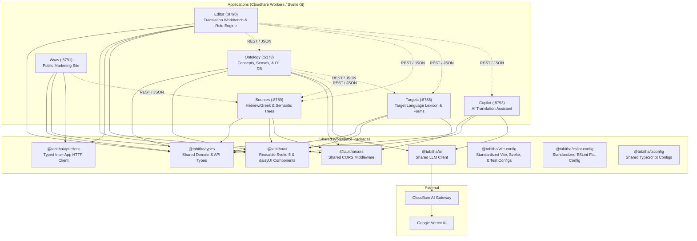

# Contributing to TaBiThA

Welcome to the **TaBiThA** monorepo! This guide covers architecture, conventions, and workflows to get you building, testing, and shipping.

---

## 🗺️ System Architecture

The TaBiThA monorepo consists of 6 modular Cloudflare Worker applications and 8 shared workspace packages managed with **pnpm workspaces** and **Turborepo**:



---

## 📂 Repository Structure

### Applications (`apps/`)

| App | Port | Local URL | Primary Responsibility |
| --- | --- | --- | --- |
| **`ontology`** | `5173` | [http://localhost:5173](http://localhost:5173) | Core linguistic knowledge base, concepts, word senses, definitions, and rule sets. Backed by Cloudflare D1 SQLite. |
| **`targets`** | `8788` | [http://localhost:8788](http://localhost:8788) | Target language generation engine, surface form inflection, and target lexicon. Backed by Cloudflare D1 SQLite. |
| **`sources`** | `8789` | [http://localhost:8789](http://localhost:8789) | Original Biblical language texts (Hebrew/Aramaic/Greek), semantic trees, and verse encodings. Backed by Cloudflare D1 SQLite. |
| **`editor`** | `8790` | [http://localhost:8790](http://localhost:8790) | Interactive translation workbench, clause parser, rule processor, and UI. |
| **`copilot`** | `8793` | [http://localhost:8793](http://localhost:8793) | AI translation guidance, theological constraint checking, and LLM calls via `@tabitha/ai` and the Cloudflare AI Gateway. |
| **`www`** | `8791` | [http://localhost:8791](http://localhost:8791) | Public-facing marketing/informational site. |

### Shared Packages (`packages/`)

| Package | Purpose |
| --- | --- |
| **`@tabitha/types`** | Universal TypeScript interfaces for linguistic concepts, clauses, tokens, references, and API payloads. |
| **`@tabitha/ui`** | Shared Svelte 5 components (buttons, badges, concept cards, headers, layouts) styled with daisyUI 5. |
| **`@tabitha/api-client`** | Typed HTTP client for inter-service communication across applications. |
| **`@tabitha/cors`** | Shared CORS middleware for Cloudflare Worker request handlers. |
| **`@tabitha/ai`** | Shared LLM client (`generate_json`, `generate_text`) routing every app's AI calls through the Cloudflare AI Gateway to Vertex AI. |
| **`@tabitha/vite-config`** | Standardized configuration helpers for Vite (`vite.config.js`), SvelteKit (`svelte.config.js`), Vitest, and Playwright (`playwright.config.js`). |
| **`@tabitha/eslint-config`** | Centralized ESLint flat configuration ensuring consistent formatting and quality rules. |
| **`@tabitha/tsconfig`** | Base TypeScript configurations (`base.json`, `svelte.json`). |

### Tooling & Scripts (`tools/` & `scripts/`)

| Directory | Purpose |
| --- | --- |
| **`tools/databases`** | Point-in-time SQLite snapshot dumps (`snapshots/`), source datasets (`data/`), and TBTA-to-TaBiThA ETL migrations (`migrations/`). |
| **`scripts/dx`** | Developer experience, database loading, and maintenance scripts: setup wizard (`setup.ts`), environment generator (`setup_env.ts`), doctor (`doctor.ts`), server menu (`dev_menu.ts`), D1 snapshot loader (`db_load.ts`), D1 inspector (`db_status.ts`), safe updater (`update_safe.ts`), favicon generator (`generate_favicons.ts`), and PWA manifest icon generator (`generate_manifest_icons.ts`). |
| **`scripts/audits`** | Automated security scanners (`check_secrets.ts`), Cloudflare linters (`check_cloudflare.ts`), cookie & storage linters (`check_storage.ts`), philosophy rules (`check_philosophies.ts`), and badge sync (`check_readme_badges.ts`) along with colocated unit tests (`*.test.ts`). |
| **`scripts/ci`** | CI/CD test coverage reporting (`report_coverage.ts`). |

### Documentation (`docs/`)

| Directory | Purpose |
| --- | --- |
| **`docs/decisions`** | Architecture Decision Records (ADRs) — the trade-offs considered and why we landed where we did on notable technical choices. See [`docs/decisions/README.md`](docs/decisions/README.md) for the format. |

---

## 🚀 Quick Setup for New Contributors

### 1. Prerequisites

- **Node.js**
- **Bun**
- **pnpm**
- **SQLite3 CLI** (`sqlite3`)

> **Windows:** `pnpm db:load`/`db:load:<app>` runs its Wrangler/Miniflare step via the system `node` binary rather than Bun, working around an unresolved Bun-on-Windows bug — see [ADR 0011](docs/decisions/0011-windows-db-load-node-fallback.md). No extra setup needed, but `node` must be on `PATH`.

### 2. Bootstrap Workspace

```bash
# 1. Install dependencies
pnpm install

# 2. Automated onboarding (creates .env.local + loads D1 SQLite databases + verifies setup)
pnpm setup

# 3. Check environment health
pnpm check:doctor
```

### 3. Start Development Servers

```bash
# Start all 6 apps concurrently
pnpm dev

# Interactive launcher (choose presets e.g. Editor + Ontology)
pnpm dev:menu

# Or start an individual app
pnpm dev:editor
pnpm dev:ontology
pnpm dev:sources
pnpm dev:targets
pnpm dev:copilot
pnpm dev:www
```

### 4. Ontology Local Permissions (first time only)

`pnpm setup` loads schema and app data, but never seeds real user grants — those only exist in production, so a fresh local Auth DB starts with nobody authorized. Sign in to Ontology (`http://localhost:5173`) with Google once; a `401` on any `/protected` page is expected. Fix it with:

```bash
pnpm db:grant your.email@example.com
```

Grants every Ontology permission to that email in your local Auth D1 only — production is untouched. Re-run after any `pnpm db:load`/`db:load:ontology`, since a fresh snapshot resets local grants too.

---

## 📐 Development Guidelines & Philosophies

All contributions should adhere to the **15 TaBiThA Development Philosophies** and coding standards defined in [**`AGENTS.md`**](AGENTS.md).

### Core Standards Quick Summary

- **The 15 Philosophies**: see [AGENTS.md](AGENTS.md) for definitions and examples of each.
- **Indentation & Formatting**: Literal `tab` characters for all indentation; `'single'` quotes; **no trailing semicolons**.
- **Naming**: `snake_case` for functions/methods/variables/files; `PascalCase` strictly for Svelte components and TS types.
- **Testing Standard**:
  - **Unit Tests (`*.test.ts`)**: 100% pure, fast in-memory Vitest tests without network or database dependencies.
  - **E2E Tests (`*.spec.ts`)**: Multi-service browser integration tests executed via Playwright.

👉 **Complete Definitions & Code Examples**: See the canonical [**`AGENTS.md`**](AGENTS.md) at the repository root.

---

## 🤖 AI-Assisted Development

TaBiThA is set up to make AI coding agents effective contributors here, whichever tool you use — none of this requires adopting any particular agent, it's infrastructure that's there if you want it.

### `AGENTS.md` — the shared source of truth

[**`AGENTS.md`**](AGENTS.md) is the canonical constitution for this repo: the 14 development philosophies, architecture and package boundaries, and secrets-vs-config rules. It's written for humans first (README and this guide both link to it), but its filename is also a convention several AI coding agents auto-discover and load as project context — so pointing an agent at this repo tends to get you conventions-aware output without extra prompting.

### `.claude/skills/` — narrower, task-scoped guidance

Some conventions are too specific to belong in AGENTS.md but still worth writing down once — e.g. `.claude/skills/typography/SKILL.md` covers when `prose` belongs on an element vs. when to escape it with `not-prose`. These are loaded contextually by Claude Code when relevant. Add a new skill here when you notice an agent (or a human) repeatedly getting a narrow, specific convention wrong.

Several skills document a specific library's usage patterns and pin the version they cover in their frontmatter (e.g. `svelte: 5.x`, `tailwindcss: 4.x`). If a PR bumps one of those libraries to a new **major** version, review the matching skill alongside it — a `pnpm update`/`pnpm update:safe` run only advances dependencies within their existing SemVer range, so it never triggers this on its own. The `daisyui` skill is the one exception: it pins a minor (`5.7.x`) rather than a major, since it's sourced from daisyUI's own `SKILL.md`, so `pnpm update:safe` checks it against the installed package automatically on every run instead of relying on someone to notice.

### `docs/decisions/` — don't relitigate settled choices

Architecture Decision Records capture the "why" behind non-obvious technical choices. Worth checking before you (or an agent) re-derive a decision that's already been made — see [`docs/decisions/README.md`](docs/decisions/README.md).

### The safety net: automated enforcement

`scripts/audits/check_philosophies.ts`, run as part of `pnpm check`/`pnpm precommit`, mechanically enforces several of the 14 philosophies. This applies equally to human- and AI-authored code, which is what keeps "let an agent try it" low-risk here — drift gets caught by the same gate either way.

### Commit messages

The IDE's AI commit-message generation is already wired to the repo's conventions — see [Commit Message Guidelines](#️-commit-message-guidelines-why-first-philosophy) above.

---

## 🌱 Branching Strategy

TaBiThA follows a lightweight GitHub Flow:

- 🔒 `main` is always deployable.
- 🌿 **Regular work**: branch off `main` → make your changes → open a PR targeting `main` → review + `pnpm precommit`/CI pass → squash-merge (branch auto-deletes). Naming your branch is up to you.
- 🚑 **Hotfixes/patches**: urgent production fixes may skip the PR and push straight to `main` — enabled by GitHub's existing admin bypass on branch protection, not a separate rule to configure. Non-admins still go through a PR.

---

## ✍️ Commit Message Guidelines ("Why-First" Philosophy)

Git diffs show *what* code changed; commit messages should explain **why** the change was made and the technical decisions behind it.

### Standard Structure

```git
<type>(<scope>): <short summary of WHAT changed (max 50-72 chars)>

[WHY]: Explain the problem, root cause, or missing capability that required this change.


[HOW/SOLUTION]: Key technical decisions, trade-offs, and architectural choices.

[IMPACT/VERIFICATION]: (Optional) Benchmarks, test coverage metrics, or side effects.
```

### Common Types

- `feat`: New user or system capability
- `fix`: Bug fix or error resolution
- `perf`: Performance optimization or speedup
- `refactor`: Code restructuring with no behavior changes
- `test`: Adding or updating test suites
- `docs`: Documentation or comment updates
- `chore`: Tooling, dependency updates, or configuration

### Convenient Git Commit Template (`.gitmessage`)

`pnpm setup` registers the repo's `.gitmessage` template (`git config commit.template .gitmessage`) — `git commit` then opens pre-populated with prompts and type reminders. Lines starting with `#` are stripped by Git.

### ✨ AI Commit "Easy Button" in IDE

If you use the **Generate ✨** button in the VS Code / IDE Source Control panel, the workspace settings (`.vscode/settings.json`) are already pre-wired to feed `.gitmessage` and the "Why-First" instructions into the AI generator:

1. Stage your changes in Git / Source Control.
2. Click **Generate ✨** in the commit message box.
3. The AI reads your staged diff and automatically drafts a structured `<type>(<scope>)`, `[WHY]`, and `[HOW/SOLUTION]` commit message.

---

## 🛠️ Common Contributor Workflows

### How to Add a New Shared Component

1. Create your component in `packages/ui/src/lib/<Component>.svelte`.
2. Export it from `packages/ui/src/index.ts`.
3. Use it in any app:

   ```svelte
   <script lang="ts">
   	import { ConceptBadge } from '@tabitha/ui'
   </script>

   <ConceptBadge label="write-01" />
   ```

### How to Add or Update Shared Domain Types

1. Add interfaces/types in `packages/types/src/`.
2. Re-export them from `packages/types/src/index.ts`.
3. In any application:

   ```typescript
   import type { Concept, LinguisticEntity } from '@tabitha/types'
   ```

### How to Add a New App-Level Configuration

All applications use `@tabitha/vite-config` and `@tabitha/eslint-config` to eliminate boilerplate:

- `vite.config.js`:

  ```javascript
  import { create_app_vite_config } from '@tabitha/vite-config'

  export default create_app_vite_config({ port: 8790 })
  ```

- `svelte.config.js`:

  ```javascript
  import { create_app_svelte_config } from '@tabitha/vite-config/svelte'

  export default create_app_svelte_config()
  ```

- `eslint.config.js`:

  ```javascript
  import tabithaConfig from '@tabitha/eslint-config'

  export default tabithaConfig
  ```

### How to Generate an App's Icons

Every app's favicon and PWA manifest icons are generated, not hand-drawn: a shared brand mark (CANIL red, the app's initial letter, a small "T" for TaBiThA) is defined once in `scripts/dx/lib/brand_mark.ts` and rendered by two scripts.

1. Add the new app's initial letter to `APP_LETTERS` in `scripts/dx/lib/brand_mark.ts`.
2. Run `pnpm gen:favicons` to write `apps/<app>/static/favicon.svg`, then reference it from `app.html`:

   ```html
   <link rel="icon" type="image/svg+xml" href="%sveltekit.assets%/favicon.svg" />
   ```

3. Run `pnpm gen:manifest-icons` to write `apps/<app>/static/icon-192.png`, `icon-512.png`, and `icon-maskable-512.png`, then reference the 192px one for iOS home-screen installs:

   ```html
   <link rel="apple-touch-icon" href="%sveltekit.assets%/icon-192.png" />
   ```

4. If the app is on `@vite-pwa/sveltekit`, point its `manifest.icons` at the three generated files (see `apps/ontology/vite.config.js` for a complete example) instead of leaving `manifest: false`.

Only the letter needs choosing per app — color, shape, and sizing are shared, so the same two commands work for every app added to the monorepo.

### How to Record an Architecture Decision

When you make a choice where the "why" isn't obvious from the code alone — picking between two viable approaches, deliberately deferring a capability, or a convention a future contributor might second-guess — capture it as an ADR:

1. Add `docs/decisions/NNNN-short-title.md`, numbered sequentially, following the format in [`docs/decisions/README.md`](docs/decisions/README.md) (Status, Context, Decision, Alternatives considered, Consequences).
2. Link it from any related ADRs, and from PR/commit descriptions where relevant.

---

## 🧪 Pre-Commit / Pre-PR Verification Gate

Before submitting a Pull Request, run the automated 1-command verification gate:

```bash
# Runs the full verification pipeline:
# 1. Typecheck, lint, and security/audit scan all packages (pnpm check)
# 2. Run all in-memory unit test suites (pnpm test)
# 3. Verify production Cloudflare Worker builds (pnpm build)
pnpm precommit
```

🚀 **Pro tip:** while iterating, `pnpm ci` runs the same scoped subset of that pipeline CI will actually run for your change (see [ADR 0008](docs/decisions/0008-ci-change-scoping.md)) — faster, but `pnpm precommit` is still the one to run before opening a PR, since it always runs everything.
