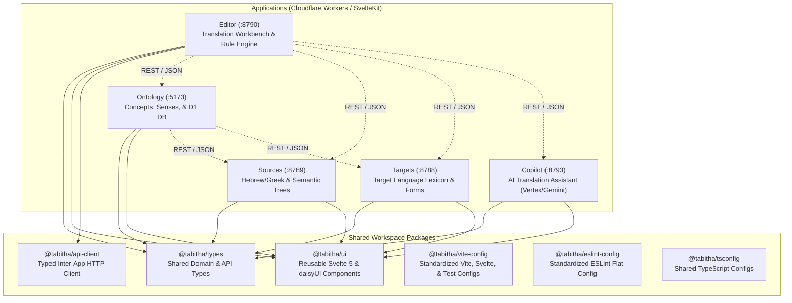

# Contributing to TaBiThA

Welcome to the **TaBiThA** monorepo! This guide explains the project's architecture, conventions, and common development workflows to help you build, test, and contribute effectively.

---

## 🗺️ System Architecture

The TaBiThA monorepo consists of 5 modular Cloudflare Worker applications and 6 shared workspace packages managed with **pnpm workspaces** and **Turborepo**:



---

## 📂 Repository Structure

### Applications (`apps/`)

| App | Port | Local URL | Primary Responsibility |
| --- | --- | --- | --- |
| **`ontology`** | `5173` | [http://localhost.tabitha.bible:5173](http://localhost.tabitha.bible:5173) | Core linguistic knowledge base, concepts, word senses, definitions, and rule sets. Backed by Cloudflare D1 SQLite. |
| **`targets`** | `8788` | [http://localhost.tabitha.bible:8788](http://localhost.tabitha.bible:8788) | Target language generation engine, surface form inflection, and target lexicon. Backed by Cloudflare D1 SQLite. |
| **`sources`** | `8789` | [http://localhost.tabitha.bible:8789](http://localhost.tabitha.bible:8789) | Original Biblical language texts (Hebrew/Aramaic/Greek), semantic trees, and verse encodings. Backed by Cloudflare D1 SQLite. |
| **`editor`** | `8790` | [http://localhost.tabitha.bible:8790](http://localhost.tabitha.bible:8790) | Interactive translation workbench, clause parser, rule processor, and UI. |
| **`copilot`** | `8793` | [http://localhost.tabitha.bible:8793](http://localhost.tabitha.bible:8793) | AI translation guidance, theological constraint checking, and Gemini API integration. |

### Shared Packages (`packages/`)

| Package | Purpose |
| --- | --- |
| **`@tabitha/types`** | Universal TypeScript interfaces for linguistic concepts, clauses, tokens, references, and API payloads. |
| **`@tabitha/ui`** | Shared Svelte 5 components (buttons, badges, concept cards, headers, layouts) styled with daisyUI 5. |
| **`@tabitha/api-client`** | Typed HTTP client for inter-service communication across applications. |
| **`@tabitha/vite-config`** | Standardized configuration helpers for Vite (`vite.config.js`), SvelteKit (`svelte.config.js`), Vitest, and Playwright (`playwright.config.js`). |
| **`@tabitha/eslint-config`** | Centralized ESLint flat configuration ensuring consistent formatting and quality rules. |
| **`@tabitha/tsconfig`** | Base TypeScript configurations (`base.json`, `svelte.json`). |

### Tooling & Database Scripts (`tools/`)

| Directory | Purpose |
| --- | --- |
| **`tools/databases`** | Database bootstrapping scripts, SQLite snapshot loaders, diagnostic utilities (`doctor.ts`), and security linters. |

---

## 🚀 Quick Setup for New Contributors

### 1. Prerequisites

- **Node.js**
- **Bun**
- **pnpm**
- **SQLite3 CLI** (`sqlite3`)

### 2. Local Domain Setup

To support clean OAuth redirects and inter-app API calls, map `localhost.tabitha.bible` to `127.0.0.1`:

- **macOS / Linux**:

  ```bash
  echo "127.0.0.1 localhost.tabitha.bible" | sudo tee -a /etc/hosts
  ```

- **Windows** (PowerShell as Admin):

  ```powershell
  Add-Content -Path C:\Windows\System32\drivers\etc\hosts -Value "127.0.0.1 localhost.tabitha.bible"
  ```

### 3. Bootstrap Workspace

```bash
# 1. Install dependencies
pnpm install

# 2. Automated onboarding (creates .env.local + loads D1 SQLite databases + verifies setup)
pnpm setup

# 3. Check environment health
pnpm check:doctor
```

### 4. Start Development Servers

```bash
# Start all 5 apps concurrently
pnpm dev

# Interactive launcher (choose presets e.g. Editor + Ontology)
pnpm dev:menu

# Or start an individual app
pnpm dev:editor
pnpm dev:ontology
pnpm dev:sources
pnpm dev:targets
pnpm dev:copilot
```

---

## 📐 Development Guidelines & Conventions

All contributions must adhere to the **Tabitha Development Philosophies**:

1. **Tabs for Indentation**: Use literal `tab` characters for all indentation.
2. **No Semicolons & Single Quotes**: Code without trailing semicolons; use `'single'` quotes for strings.
3. **Naming Conventions**:
   - `snake_case` for functions, methods, variables, file names, and directories (`process_concept_data()`, `user_profile.ts`).
   - `PascalCase` strictly for Svelte component names and TypeScript interfaces/types (`ConceptCard.svelte`, `type LinguisticEntity`).
4. **daisyUI 5 & Semantic HTML**:
   - Use semantic HTML tags (`<article>`, `<dialog>`, `<nav>`) styled with daisyUI 5 component classes (`card`, `btn`, `modal`, `badge`).
   - Place `class="..."` at the end of element attributes to prioritize functional behavior:

     ```svelte
     <button
     	type="submit"
     	disabled={is_loading}
     	onclick={handle_save}
     	class="btn btn-primary btn-sm"
     >
     	Save
     </button>
     ```

5. **Pure In-Memory Unit Tests vs. End-to-End Tests**:
   - **Unit Tests (`apps/*/src/**/*.test.ts`)**: Must be 100% pure, fast, in-memory Vitest tests with zero network dependencies or live database requirements.
   - **E2E / Integration Tests (`apps/*/e2e/*.spec.ts`)**: Cross-service network tests and browser flows executed with Playwright.

---

## ✍️ Commit Message Guidelines ("Why-First" Philosophy)

Git diffs show *what* code changed; commit messages should explain **why** the change was made and the technical decisions behind it.

### Standard Structure

```git
<type>(<scope>): <short summary of WHAT changed (max 50-72 chars)>

[WHY]: Explain the problem, root cause, or missing capability that required this change.

[HOW/SOLUTION]: Key technical decisions, trade-offs, and architectural choices.

[IMPACT/VERIFICATION]: (Optional) Benchmarks, test coverage metrics, or side effects.
```

### Common Types

- `feat`: New user or system capability
- `fix`: Bug fix or error resolution
- `perf`: Performance optimization or speedup
- `refactor`: Code restructuring with no behavior changes
- `test`: Adding or updating test suites
- `docs`: Documentation or comment updates
- `chore`: Tooling, dependency updates, or configuration

### Convenient Git Commit Template (`.gitmessage`)

Running `pnpm setup` automatically registers the repository's `.gitmessage` template (`git config commit.template .gitmessage`). When you run `git commit` (or commit via your IDE), your editor will open pre-populated with prompts and type reminders. Lines starting with `#` are automatically stripped out by Git.

---

## 🛠️ Common Contributor Workflows

### How to Add a New Shared Component

1. Create your component in `packages/ui/src/lib/<Component>.svelte`.
2. Export it from `packages/ui/src/index.ts`.
3. Use it in any app:

   ```svelte
   <script lang="ts">
   	import { ConceptBadge } from '@tabitha/ui'
   </script>

   <ConceptBadge label="write-01" />
   ```

### How to Add or Update Shared Domain Types

1. Add interfaces/types in `packages/types/src/`.
2. Re-export them from `packages/types/src/index.ts`.
3. In any application:

   ```typescript
   import type { Concept, LinguisticEntity } from '@tabitha/types'
   ```

### How to Add a New App-Level Configuration

All applications use `@tabitha/vite-config` and `@tabitha/eslint-config` to eliminate boilerplate:

- `vite.config.js`:

  ```javascript
  import { create_app_vite_config } from '@tabitha/vite-config'

  export default create_app_vite_config({ port: 8790 })
  ```

- `svelte.config.js`:

  ```javascript
  import { create_app_svelte_config } from '@tabitha/vite-config/svelte'

  export default create_app_svelte_config()
  ```

- `eslint.config.js`:

  ```javascript
  import tabithaConfig from '@tabitha/eslint-config'

  export default tabithaConfig
  ```

---

## 🧪 Pre-Commit / Pre-PR Verification Gate

Before submitting a Pull Request, run the automated 1-command verification gate:

```bash
# Runs the full verification pipeline:
# 1. Typecheck & lint all 15 packages (pnpm check)
# 2. Run all 421 unit test suites (pnpm test:unit)
# 3. Scan for secrets & credential leaks (pnpm check:secrets)
# 4. Validate Cloudflare Worker configurations (pnpm check:cloudflare)
# 5. Verify Markdown documentation linting (pnpm check:md)
# 6. Verify production Cloudflare Worker builds (pnpm build)
pnpm precommit
```
