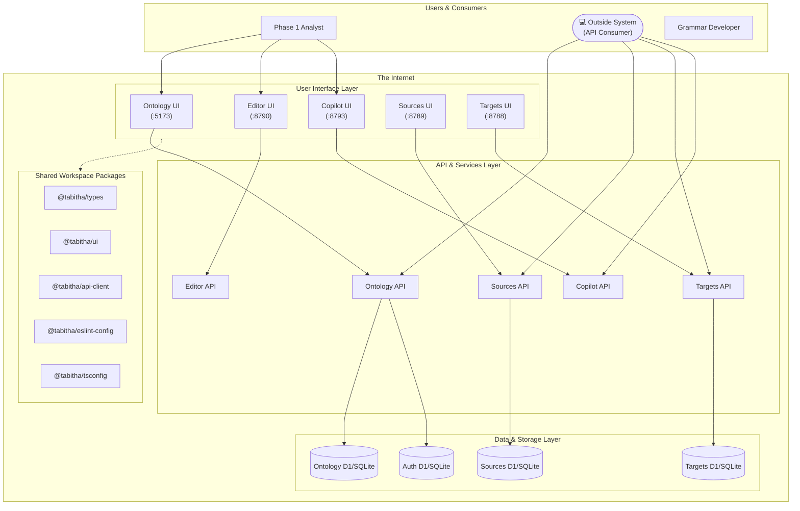

# TaBiThA Monorepo

Welcome to the **TaBiThA** monorepo. This repository houses all core deployable web applications, developer tools, shared libraries, and linguistic pipelines for the TaBiThA translation platform.

---

## 🚀 Applications & Dedicated Ports

All applications are built with **Svelte**, **SvelteKit**, **Tailwind CSS**, and **daisyUI**, deployed as Cloudflare Workers. Each app has a dedicated, non-overlapping local port configured for seamless multi-app development.

| Application | Path | Local Dev URL | Dedicated Port | Production URL | Notes |
| --- | --- | --- | --- | --- | --- |
| **Ontology** | `apps/ontology` | `http://localhost.tabitha.bible:5173` | `5173` | [ontology.tabitha.bible](https://ontology.tabitha.bible) | `strictPort: true` for Google/GitHub OAuth callback configurations |
| **Targets** | `apps/targets` | `http://localhost.tabitha.bible:8788` | `8788` | [targets.tabitha.bible](https://targets.tabitha.bible) | Target language generation search and forms API |
| **Sources** | `apps/sources` | `http://localhost.tabitha.bible:8789` | `8789` | [sources.tabitha.bible](https://sources.tabitha.bible) | Source text analysis and semantic encoding explorer |
| **Editor** | `apps/editor` | `http://localhost.tabitha.bible:8790` | `8790` | [editor.tabitha.bible](https://editor.tabitha.bible) | Grammar & rule checker, backtranslator, AI assistant |
| **Copilot** | `apps/copilot` | `http://localhost.tabitha.bible:8793` | `8793` | [copilot.tabitha.bible](https://copilot.tabitha.bible) | Translation notes, brief extraction, and AI copilot |

---

## 📦 Monorepo Structure

```text
tabitha/
├── apps/
│   ├── copilot/     # AI Copilot & translation notes generator
│   ├── editor/      # Semantic editor, rule parser & backtranslator
│   ├── ontology/    # Central ontology database & concept management (Auth.js)
│   ├── sources/     # Source entities, lookups, and feature explorer
│   └── targets/     # Target grammar, project search, and lexicons
├── packages/
│   ├── eslint-config/  # Shared ESLint 9 configuration (@tabitha/eslint-config)
│   ├── tsconfig/       # Base TypeScript configurations (@tabitha/tsconfig)
│   └── ui/             # Shared Svelte 5 / daisyUI components (@tabitha/ui)
├── tools/
│   └── databases/   # SQLite database backups, schema dumps & sync tools
├── pnpm-workspace.yaml
├── turbo.json
└── package.json
```

---

## 🛠️ Getting Started & Commands

### Prerequisites

- **Node.js**
- **pnpm**

### Quick Start

```bash
# 1. Install all dependencies across workspace
pnpm install

# 2. Automated developer onboarding (environment scaffolding + DB loading + verification)
pnpm setup

# 3. Run all dev servers in parallel
pnpm dev
```

### Local Domain Setup (`localhost.tabitha.bible`)

To support OAuth callbacks and cross-app communication, all apps run under `*.tabitha.bible`. Map this domain to `127.0.0.1`:

- **macOS / Linux (Terminal)**:

  ```bash
  echo "127.0.0.1 localhost.tabitha.bible" | sudo tee -a /etc/hosts
  ```

- **Windows (Run PowerShell as Administrator)**:

  ```powershell
  Add-Content -Path C:\Windows\System32\drivers\etc\hosts -Value "127.0.0.1 localhost.tabitha.bible"
  ```

### Database & Environment Workflows

```bash
# Load all SQLite/D1 databases from snapshots into local Wrangler environments
pnpm db:load

# Load database for a specific app
pnpm db:load:ontology
pnpm db:load:sources
pnpm db:load:targets

# Scaffold .env.local files from .env templates
pnpm setup:env
```

### Running Specific Dev Servers

```bash
pnpm dev:ontology   # http://localhost.tabitha.bible:5173
pnpm dev:targets    # http://localhost.tabitha.bible:8788
pnpm dev:sources    # http://localhost.tabitha.bible:8789
pnpm dev:editor     # http://localhost.tabitha.bible:8790
pnpm dev:copilot    # http://localhost.tabitha.bible:8793
```

### Verification & Testing

```bash
# Run typechecking (svelte-check) and linting across all apps
pnpm check

# Run ESLint with auto-fix across all apps
pnpm check:lint:fix

# Audit codebase compliance against Development Philosophies
pnpm check:philosophies

# Run Markdown linting across all documentation
pnpm check:md

# Run unit test suites in parallel (Vitest)
pnpm test:unit

# Build all applications for production (Cloudflare Workers)
pnpm build

# Clean and re-install entire workspace
pnpm clean:powerwash
```

### Local CI/CD Workflow Testing (Optional)

For developers developing or testing GitHub Actions workflows in `.github/workflows/` locally, you can use [`act`](https://github.com/nektos/act) to run workflows in local Docker containers:

```bash
# Installation:
# macOS:   brew install act
# Windows: winget install nektos.act
# Linux:   https://github.com/nektos/act#installation

# List available workflow jobs:
act -l

# Run the CI verification job locally:
act -j verify

# Simulate a pull request event:
act pull_request
```

---

## 🧩 Architecture Overview


```mermaid
graph TD;
    subgraph "Users & Consumers"
        direction LR
        Phase1Analyst[Phase 1 Analyst];
        OutsideSystem(["💻 Outside System <br/>(API Consumer)"]);
        GrammarDeveloper[Grammar Developer];
    end

    subgraph Platform ["The Internet"]
        direction TB

        subgraph UILayer ["User Interface Layer"]
            direction LR
            OntologyUI["Ontology UI <br/>(:5173)"];
            EditorUI["Editor UI <br/>(:8790)"];
            CopilotUI["Copilot UI <br/>(:8793)"];
            SourcesUI["Sources UI <br/>(:8789)"];
            TargetsUI["Targets UI <br/>(:8788)"];
        end

        subgraph APILayer ["API & Services Layer"]
            direction LR
            OntologyAPI[Ontology API];
            EditorAPI[Editor API];
            SourcesAPI[Sources API];
            TargetsAPI[Targets API];
            CopilotAPI[Copilot API];
        end

        subgraph SharedPackages ["Shared Workspace Packages"]
            direction LR
            TypesPkg["@tabitha/types"];
            UIPkg["@tabitha/ui"];
            APIClientPkg["@tabitha/api-client"];
            ESLintPkg["@tabitha/eslint-config"];
            TSConfigPkg["@tabitha/tsconfig"];
        end

        subgraph DataLayer ["Data & Storage Layer"]
            direction LR
            OntologyDB[(Ontology D1/SQLite)];
            SourcesDB[(Sources D1/SQLite)];
            TargetsDB[(Targets D1/SQLite)];
            AuthDB[(Auth D1/SQLite)];
        end
    end

    Phase1Analyst --> OntologyUI;
    Phase1Analyst --> EditorUI;
    Phase1Analyst --> CopilotUI;
    OutsideSystem --> OntologyAPI;
    OutsideSystem --> SourcesAPI;
    OutsideSystem --> TargetsAPI;
    OutsideSystem --> CopilotAPI;

    OntologyUI --> OntologyAPI;
    EditorUI --> EditorAPI;
    SourcesUI --> SourcesAPI;
    TargetsUI --> TargetsAPI;
    CopilotUI --> CopilotAPI;

    UILayer -.-> SharedPackages;

    OntologyAPI --> OntologyDB;
    OntologyAPI --> AuthDB;
    SourcesAPI --> SourcesDB;
    TargetsAPI --> TargetsDB;
```

---

## 📖 TBTA Linguistic Basics

### What Does TBTA Do?

#### 1. Source Text (Mark 1:2 NIV)

> *"as it is written in Isaiah the prophet: 'I will send my messenger ahead of you, who will prepare your way'"*

#### 2. Phase 1 Encoded Form

> *Isaiah [who told God's messages to people] wrote, ["You(Christ) (imp) listen to me(God)]. I(God) (primary) will send my(God's) person [who takes messages to people] [before I(God) send you(Christ)]. I(God) (meaning-1) will send my(God's) person [who takes messages to people] in-front-of you(Christ). (literal) And that person/messenger will prepare-B your(Christ's) path." (dynamic) And that person/messenger will say/announce [you(Christ) are coming]."*

#### 3. Simplified Semantic Form

```text
[C [NP Isaiah(N) [C [NP Isaiah(N) ] [VP tell-D(V) ] [NP message(N) [NP -Generic Genitive(Adp) God(N) ] ] [NP person(N) ] ] ] [VP write-C(V) ] [C -QuoteBegin(Par) [NP Christ(N) ] [VP listen(V) ] [NP God(N) ] ] . ]
```

#### 4. Generation to Target Language

> *Isaiah, who was a prophet, wrote, “Listen to me. Before I send you, I'll send my messenger. And that messenger will prepare your path."*

---

### Core Linguistic Components

1. **Ontology (`apps/ontology`)**: Central store of all semantic concepts, meanings, part of speech, and contextual usage rules.
2. **Semantic Representation (`apps/sources`)**: TBTA clause and phrase structure encodings and semantic feature flags.
3. **Lexicon & Grammar (`apps/targets`)**: Target language vocabulary, features, and transformational grammar rules.
4. **Editor & Rule Engine (`apps/editor`)**: Grammar checking, validation, and automated backtranslation.
5. **Translation Copilot (`apps/copilot`)**: Flag extraction, contextual notes, and AI-assisted consultant briefs.

---

### Development Philosophies

#### 1. Self-contained components

Parents manage layout, positioning, and context; components encapsulate their own behavior and styling.

```svelte
<!-- Parent.svelte: Handles grid/layout and passes down data -->
<div class="grid grid-cols-3 gap-4">
   <ConceptCard concept="{active_concept}"/>
</div>

<!-- ConceptCard.svelte: Self-contained styling & local state -->
<script lang="ts">
   let { concept }: { concept: Concept } = $props();
   let is_expanded = $state(false);
</script>

<article class="card bg-base-100 shadow-sm border border-base-200">
   <div class="card-body">
      <h2 class="card-title">{concept.label}</h2>
      <button
         type="button"
         onclick={() => (is_expanded = !is_expanded)}
         class="btn btn-sm btn-ghost"
      >
         {is_expanded ? 'Show Less' : 'Show More'}
      </button>
   </div>
</article>
```

---

#### 2. Normalized data

Keep data normalized as close to the source as possible with deterministic, side-effect-free transformations.

```typescript
// Normalized entities by unique ID
interface EntityState {
   by_id: Record<string, Word>;
   all_ids: string[];
}

// Deterministic, pure updater
const normalize_words = (raw_words: Word[]): EntityState => ({
   by_id: Object.fromEntries(raw_words.map((w) => [w.id, w])),
   all_ids: raw_words.map((w) => w.id)
});
```

---

#### 3. Tabs for indentation

Indent code using `tab` characters (spaces per tab width is individual developer preference).

```typescript
export const get_entity_id = (entity: SourceEntity): string => {
   const sanitized_id = entity.id.trim().toLowerCase();
   return sanitized_id;
};
```

---

#### 4. Code over comments

Self-documenting code with descriptive naming is preferred over excessive commenting.

```typescript
// ❌ Avoid: Vague names patched with comments
// Check if word is valid and not expired
const check = (w: Word) => w.s === 'active' && w.exp > Date.now();

// ✅ Preferred: Intention revealed directly by naming
const is_word_active_and_unexpired = (word: Word): boolean => {
   const is_active = word.status === 'active';
   const is_not_expired = word.expires_at > Date.now();
   return is_active && is_not_expired;
};
```

---

#### 5. Classes at the end of elements

Place `class="..."` after functional attributes and event handlers to prioritize behavior readability.

```svelte
<!-- ❌ Avoid -->
<button class="btn btn-primary btn-sm" type="submit" disabled={is_loading} onclick={handle_save}>
   Save
</button>

<!-- ✅ Preferred -->
<button
   type="submit"
   disabled={is_loading}
   onclick={handle_save}
   class="btn btn-primary btn-sm"
>
   Save
</button>
```

---

#### 6. Guard clauses over nested logic

Favor early returns to keep control flow flat and readable.

```typescript
// ❌ Avoid nested pyramid
const process_concept = (concept: Concept | null) => {
   if (concept) {
      if (concept.is_verified) {
         return concept.label.toUpperCase();
      }
   }
   return null;
};

// ✅ Flat flow with guard clauses
const process_concept = (concept: Concept | null): string | null => {
   if (!concept) return null;
   if (!concept.is_verified) return null;

   return concept.label.toUpperCase();
};
```

---

#### 7. Strict domain typing

Model linguistic entities (`Concept`, `SourceEntity`, `Word`) with explicit types and discriminating unions—avoid `any` if possible.

```typescript
interface BaseEntity {
   readonly id: string;
   readonly created_at: number;
}

export type LinguisticEntity =
   | ({ readonly kind: 'concept'; readonly label: string } & BaseEntity)
   | ({ readonly kind: 'word'; readonly lemma: string; readonly pos: string } & BaseEntity)
   | ({ readonly kind: 'source_entity'; readonly source_uri: string } & BaseEntity);

export const resolve_display_label = (entity: LinguisticEntity): string => {
   switch (entity.kind) {
      case 'concept':
         return entity.label;
      case 'word':
         return `${entity.lemma} (${entity.pos})`;
      case 'source_entity':
         return entity.source_uri;
   }
};
```

---

#### 8. Semantic HTML & daisyUI

Leverage native HTML elements and semantic markup styled via daisyUI utility components.

```svelte
<dialog open class="modal modal-bottom sm:modal-middle">
   <div class="modal-box">
      <h3 class="font-bold text-lg">Confirm Action</h3>
      <p class="py-4">Are you sure you want to delete this entity?</p>
      <div class="modal-action">
         <form method="dialog" class="flex gap-2">
            <button value="cancel" class="btn btn-ghost">Cancel</button>
            <button value="confirm" class="btn btn-error">Confirm</button>
         </form>
      </div>
   </div>
</dialog>
```

---

#### 9. Limit use of `if`

Consider more elegant solutions (lookup tables, pattern matching, polymorphism, or logical chaining) before resorting to `if` statements.

```typescript
// ❌ Avoid multiple if/else branches
const get_badge_class = (status: string) => {
   if (status === 'active') return 'badge-success';
   if (status === 'pending') return 'badge-warning';
   if (status === 'archived') return 'badge-neutral';
   return 'badge-ghost';
};

// ✅ Preferred: Object map / dictionary lookup
const STATUS_BADGE_MAP: Record<string, string> = {
   active: 'badge-success',
   pending: 'badge-warning',
   archived: 'badge-neutral'
} as const;

const get_badge_class = (status: string): string =>
   STATUS_BADGE_MAP[status] ?? 'badge-ghost';
```

---

#### 10. `snake_case` for functions and variables

Use `snake_case` for all function, method, and variable names. Reserve `PascalCase` strictly for Svelte components and TypeScript types/interfaces.

```typescript
// Types/Interfaces in PascalCase
interface ConceptPayload {
   concept_id: string;
   root_term: string;
}

// Variables and functions in snake_case
const default_payload: ConceptPayload = {
   concept_id: 'c_101',
   root_term: 'lexicon'
};

export const fetch_concept_data = async (payload: ConceptPayload): Promise<Concept> => {
   const response_data = await fetch(`/api/concepts/${payload.concept_id}`);
   return response_data.json();
};
```

---

#### 11. Pure functions

Functions should be pure and free of side effects. Strive to receive one argument (destructuring an options object if multiple inputs are required) and return one value.

```typescript
interface FormatWordOptions {
   readonly word: Word;
   readonly prefix?: string;
}

// Pure: depends only on its input, single argument object, no external mutation
export const format_word_label = ({
   word,
   prefix = ''
}: FormatWordOptions): string => {
   const cleaned_lemma = word.lemma.trim().toLowerCase();
   return prefix ? `${prefix}:${cleaned_lemma}` : cleaned_lemma;
};
```
