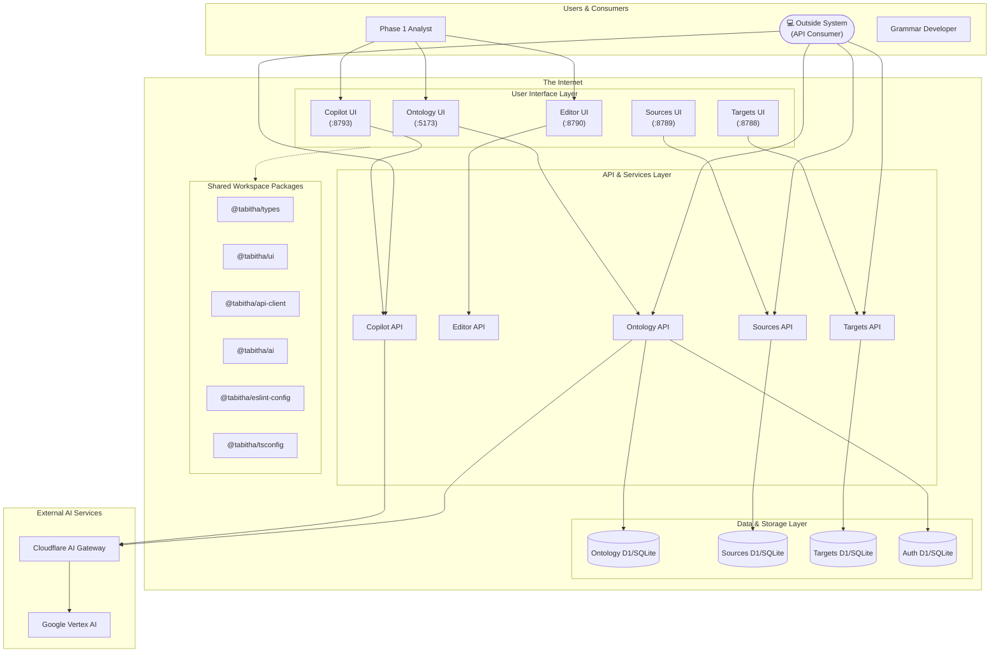

# TaBiThA Monorepo

<p align="left">
  <a href="https://github.com/presciencelabs/tabitha/actions/workflows/ci.yml"></a>
  <a href="https://svelte.dev"></a>
  <a href="https://www.typescriptlang.org"></a>
  <a href="https://tailwindcss.com"></a>
  <a href="https://daisyui.com"></a>
  <a href="https://workers.cloudflare.com"></a>
  <a href="https://turbo.build/repo"></a>
  <a href="https://pnpm.io"></a>
  <a href="https://vitest.dev"></a>
  <a href="https://playwright.dev"></a>
  <a href="AGENTS.md"></a>
</p>

This repository houses all core deployable web applications, developer tools, shared libraries, and linguistic pipelines for the TaBiThA translation platform.

---

## 🚀 Applications & Dedicated Ports

Built with **Svelte**, **SvelteKit**, **Tailwind CSS**, and **daisyUI**, deployed as Cloudflare Workers — each app gets a dedicated, non-overlapping port for multi-app dev.

| Application | Path | Local Dev URL | Dedicated Port | Production URL | Notes |
| --- | --- | --- | --- | --- | --- |
| **Ontology** | `apps/ontology` | `http://localhost:5173` | `5173` | [ontology.tabitha.bible](https://ontology.tabitha.bible) | `strictPort: true` for Google/GitHub OAuth callback configurations |
| **Targets** | `apps/targets` | `http://localhost:8788` | `8788` | [targets.tabitha.bible](https://targets.tabitha.bible) | Target language generation search and forms API |
| **Sources** | `apps/sources` | `http://localhost:8789` | `8789` | [sources.tabitha.bible](https://sources.tabitha.bible) | Source text analysis and semantic encoding explorer |
| **Editor** | `apps/editor` | `http://localhost:8790` | `8790` | [editor.tabitha.bible](https://editor.tabitha.bible) | Grammar & rule checker, backtranslator, AI assistant |
| **Copilot** | `apps/copilot` | `http://localhost:8793` | `8793` | [copilot.tabitha.bible](https://copilot.tabitha.bible) | Translation notes, brief extraction, and AI copilot |

---

## 📦 Monorepo Structure

```text
tabitha/
├── apps/
│   ├── copilot/     # AI Copilot & translation notes generator
│   ├── editor/      # Semantic editor, rule parser & backtranslator
│   ├── ontology/    # Central ontology database & concept management (Auth.js)
│   ├── sources/     # Source entities, lookups, and feature explorer
│   └── targets/     # Target grammar, project search, and lexicons
├── packages/
│   ├── eslint-config/  # Shared ESLint 9 configuration (@tabitha/eslint-config)
│   ├── tsconfig/       # Base TypeScript configurations (@tabitha/tsconfig)
│   └── ui/             # Shared Svelte 5 / daisyUI components (@tabitha/ui)
├── scripts/         # Monorepo maintenance, DX tooling & CI audit scripts
│   ├── audits/      # Quality, philosophy, secret & storage linters (+ colocated tests)
│   ├── ci/          # CI test coverage reporting
│   └── dx/          # Setup wizard, doctor, dev server menu, D1 loaders & safe updater
├── tools/
│   └── databases/   # SQLite snapshots, ETL migration pipeline & reference datasets
├── docs/
│   └── decisions/   # Architecture decision records — the "why" behind notable technical choices
├── pnpm-workspace.yaml
├── turbo.json
└── package.json
```

---

## 🛠️ Getting Started & Commands

### Prerequisites

- **Node.js**
- **Bun**
- **pnpm**
- **SQLite3 CLI** (`sqlite3`)

### Quick Start

```bash
# 1. Install all dependencies across workspace
pnpm install

# 2. Automated developer onboarding (environment scaffolding + DB loading + verification)
pnpm setup

# 3. Run all dev servers in parallel
pnpm dev
```

### Database & Environment Workflows

```bash
# Load all SQLite/D1 databases from snapshots into local Wrangler environments
pnpm db:load

# Load database for a specific app
pnpm db:load:ontology
pnpm db:load:sources
pnpm db:load:targets

# Inspect local D1 database tables, row counts, and snapshot status
pnpm db:status

# Scaffold .env.local files from .env templates
pnpm setup:env
```

### Running Specific Dev Servers

```bash
# Interactive app selector & preset menu
pnpm dev:menu

# Or start a specific application directly
pnpm dev:ontology   # http://localhost:5173
pnpm dev:targets    # http://localhost:8788
pnpm dev:sources    # http://localhost:8789
pnpm dev:editor     # http://localhost:8790
pnpm dev:copilot    # http://localhost:8793
```

### 🧪 Local Smoke Test ("Golden Path")

To verify that all local applications, databases, and inter-app APIs are working together:

1. **Start all dev servers**: `pnpm dev`
2. **Open the Editor**: [http://localhost:8790](http://localhost:8790)
3. **Type `Paul write-A a letter.` into the text box and click Check**:
   - *Verifies Editor (`:8790`)*: Parses tokens and, on clicking the `write-A` token, shows a popup with a clickable concept link.
4. **Click the `write-A` link in that popup**:
   - *Verifies Ontology (`:5173`)*: Navigates to [http://localhost:5173/?q=write-A](http://localhost:5173/?q=write-A) and loads definitions from the local D1 database.
5. **Expand any "Usage Example" accordion in Ontology**:
   - *Verifies Sources (`:8789`)*: Fetches and displays the semantic clause parse tree.
   - *Verifies Targets (`:8788`)*: Fetches and displays the generated English translation text.

### Verification & Testing

```bash
# Run typechecking (svelte-check) and linting across all apps
pnpm check

# Run ESLint with auto-fix across all apps
pnpm check:lint:fix

# Run full workspace environment and health diagnostics
pnpm check:doctor

# Audit codebase compliance against Development Philosophies
pnpm check:philosophies

# Scan codebase for exposed secrets and credentials
pnpm check:secrets

# Validate Cloudflare Workers wrangler.jsonc configurations
pnpm check:cloudflare

# Audit client storage hygiene and cookie security
pnpm check:storage

# Run Markdown linting across all documentation
pnpm check:md

# Run unit test suites in parallel (Vitest)
pnpm test:unit

# Build all applications for production (Cloudflare Workers)
pnpm build

# Clean and re-install entire workspace
pnpm clean:powerwash
```

### Dependency Maintenance & Upgrades

```bash
# Safely update dependencies within declared SemVer ranges, check Cloudflare compat dates, and run verification gate
pnpm update:safe

# Interactively review and upgrade to latest major releases
pnpm update:interactive
```

### Local CI/CD Workflow Testing (Optional)

To test GitHub Actions workflows in `.github/workflows/` locally, use [`act`](https://github.com/nektos/act) to run them in local Docker containers:

```bash
# Installation:
# macOS:   brew install act
# Windows: winget install nektos.act
# Linux:   https://github.com/nektos/act#installation

# List available workflow jobs:
act -l

# Run the CI verification job locally:
act -j verify

# Simulate a pull request event:
act pull_request
```

---

## 🧩 Architecture Overview


```mermaid
graph TD;
    subgraph "Users & Consumers"
        direction LR
        Phase1Analyst[Phase 1 Analyst];
        OutsideSystem(["💻 Outside System <br/>(API Consumer)"]);
        GrammarDeveloper[Grammar Developer];
    end

    subgraph Platform ["The Internet"]
        direction TB

        subgraph UILayer ["User Interface Layer"]
            direction LR
            OntologyUI["Ontology UI <br/>(:5173)"];
            EditorUI["Editor UI <br/>(:8790)"];
            CopilotUI["Copilot UI <br/>(:8793)"];
            SourcesUI["Sources UI <br/>(:8789)"];
            TargetsUI["Targets UI <br/>(:8788)"];
        end

        subgraph APILayer ["API & Services Layer"]
            direction LR
            OntologyAPI[Ontology API];
            EditorAPI[Editor API];
            SourcesAPI[Sources API];
            TargetsAPI[Targets API];
            CopilotAPI[Copilot API];
        end

        subgraph SharedPackages ["Shared Workspace Packages"]
            direction LR
            TypesPkg["@tabitha/types"];
            UIPkg["@tabitha/ui"];
            APIClientPkg["@tabitha/api-client"];
            AIPkg["@tabitha/ai"];
            ESLintPkg["@tabitha/eslint-config"];
            TSConfigPkg["@tabitha/tsconfig"];
        end

        subgraph DataLayer ["Data & Storage Layer"]
            direction LR
            OntologyDB[(Ontology D1/SQLite)];
            SourcesDB[(Sources D1/SQLite)];
            TargetsDB[(Targets D1/SQLite)];
            AuthDB[(Auth D1/SQLite)];
        end
    end

    subgraph ExternalServices ["External AI Services"]
        direction LR
        AIGateway["Cloudflare AI Gateway"];
        VertexAI["Google Vertex AI"];
    end

    Phase1Analyst --> OntologyUI;
    Phase1Analyst --> EditorUI;
    Phase1Analyst --> CopilotUI;
    OutsideSystem --> OntologyAPI;
    OutsideSystem --> SourcesAPI;
    OutsideSystem --> TargetsAPI;
    OutsideSystem --> CopilotAPI;

    OntologyUI --> OntologyAPI;
    EditorUI --> EditorAPI;
    SourcesUI --> SourcesAPI;
    TargetsUI --> TargetsAPI;
    CopilotUI --> CopilotAPI;

    UILayer -.-> SharedPackages;

    OntologyAPI --> OntologyDB;
    OntologyAPI --> AuthDB;
    SourcesAPI --> SourcesDB;
    TargetsAPI --> TargetsDB;

    OntologyAPI --> AIGateway;
    CopilotAPI --> AIGateway;
    AIGateway --> VertexAI;
```

---

## 📖 TBTA Linguistic Basics

### What Does TBTA Do?

#### 1. Source Text (Mark 1:2 NIV)

> *"as it is written in Isaiah the prophet: 'I will send my messenger ahead of you, who will prepare your way'"*

#### 2. Phase 1 Encoded Form

> *Isaiah [who told God's messages to people] wrote, ["You(Christ) (imp) listen to me(God)]. I(God) (primary) will send my(God's) person [who takes messages to people] [before I(God) send you(Christ)]. I(God) (meaning-1) will send my(God's) person [who takes messages to people] in-front-of you(Christ). (literal) And that person/messenger will prepare-B your(Christ's) path." (dynamic) And that person/messenger will say/announce [you(Christ) are coming]."*

#### 3. Simplified Semantic Form

```text
[C [NP Isaiah(N) [C [NP Isaiah(N) ] [VP tell-D(V) ] [NP message(N) [NP -Generic Genitive(Adp) God(N) ] ] [NP person(N) ] ] ] [VP write-C(V) ] [C -QuoteBegin(Par) [NP Christ(N) ] [VP listen(V) ] [NP God(N) ] ] . ]
```

#### 4. Generation to Target Language

> *Isaiah, who was a prophet, wrote, “Listen to me. Before I send you, I'll send my messenger. And that messenger will prepare your path."*

---

### Core Linguistic Components

1. **Ontology (`apps/ontology`)**: Central store of all semantic concepts, meanings, part of speech, and contextual usage rules.
2. **Semantic Representation (`apps/sources`)**: TBTA clause and phrase structure encodings and semantic feature flags.
3. **Lexicon & Grammar (`apps/targets`)**: Target language vocabulary, features, and transformational grammar rules.
4. **Editor & Rule Engine (`apps/editor`)**: Grammar checking, validation, automated backtranslation, and AI-assisted Phase 1 encoding.
5. **Translation Copilot (`apps/copilot`)**: Flag extraction, contextual notes, and AI-assisted consultant briefs.

---

### Development Philosophies

All code in this repository adheres to the **TaBiThA Development Philosophies**. For complete definitions, detailed guidelines, and code examples, see the canonical [**AGENTS.md**](AGENTS.md).

| # | Philosophy | Core Tenet |
| :-: | :--- | :--- |
| **1** | **Self-contained components** | Parents manage layout and context; components encapsulate internal behavior and daisyUI styling. |
| **2** | **Normalized data** | Keep data normalized close to source with pure, deterministic transformations. |
| **3** | **Tabs for indentation** | Literal `tab` characters for indentation across all languages and configuration files. |
| **4** | **Code over comments** | Self-documenting code with intention-revealing names over excessive commenting. |
| **5** | **Classes at the end of elements** | Place `class="..."` after functional attributes and event handlers in Svelte templates. |
| **6** | **Guard clauses over nested logic** | Early returns to keep control flow flat and readable. |
| **7** | **Strict domain typing** | Explicit TypeScript interfaces and discriminating unions for linguistic models (avoid `any`). |
| **8** | **Semantic HTML & daisyUI 5** | Native HTML semantic tags (`<dialog>`, `<article>`, `<nav>`) styled with daisyUI 5 component classes. |
| **9** | **Limit use of `if`** | Object lookup maps, pattern matching, or polymorphism over deep `if`/`else` branches. |
| **10** | **`snake_case` naming** | `snake_case` for functions, variables, and files; `PascalCase` strictly for Svelte components and TS types. |
| **11** | **Pure functions** | Side-effect-free functions receiving one options object argument and returning one value. |
| **12** | **YAGNI & Minimal Surface Area** | Solve today's concrete need; adhere to the Rule of Three before extracting code to `packages/*`. |

> 📖 **Full Philosophy Guide & Examples**: See [**`AGENTS.md`**](AGENTS.md) at the workspace root.
