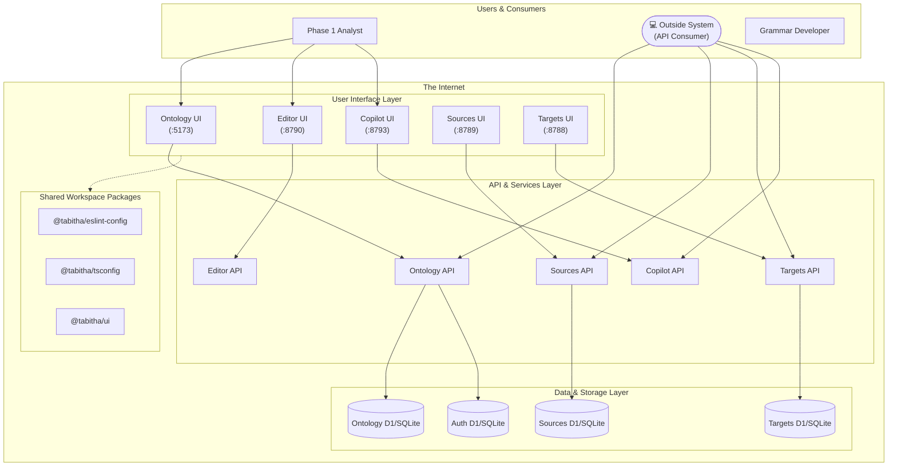

# TaBiThA Monorepo

Welcome to the **TaBiThA** monorepo. This repository houses all core deployable web applications, developer tools, shared libraries, and linguistic pipelines for the TaBiThA translation platform.

---

## 🚀 Applications & Dedicated Ports

All applications are built with **Svelte**, **SvelteKit**, **Tailwind CSS**, and **daisyUI**, deployed as Cloudflare Workers. Each app has a dedicated, non-overlapping local port configured for seamless multi-app development.

| Application | Path | Local Dev URL | Dedicated Port | Production URL | Notes |
| --- | --- | --- | --- | --- | --- |
| **Ontology** | `apps/ontology` | `http://localhost.tabitha.bible:5173` | `5173` | [ontology.tabitha.bible](https://ontology.tabitha.bible) | `strictPort: true` for Google/GitHub OAuth callback configurations |
| **Targets** | `apps/targets` | `http://localhost.tabitha.bible:8788` | `8788` | [targets.tabitha.bible](https://targets.tabitha.bible) | Target language generation search and forms API |
| **Sources** | `apps/sources` | `http://localhost.tabitha.bible:8789` | `8789` | [sources.tabitha.bible](https://sources.tabitha.bible) | Source text analysis and semantic encoding explorer |
| **Editor** | `apps/editor` | `http://localhost.tabitha.bible:8790` | `8790` | [editor.tabitha.bible](https://editor.tabitha.bible) | Grammar & rule checker, backtranslator, AI assistant |
| **Copilot** | `apps/copilot` | `http://localhost.tabitha.bible:8793` | `8793` | [copilot.tabitha.bible](https://copilot.tabitha.bible) | Translation notes, brief extraction, and AI copilot |

---

## 📦 Monorepo Structure

```text
tabitha/
├── apps/
│   ├── copilot/     # AI Copilot & translation notes generator
│   ├── editor/      # Semantic editor, rule parser & backtranslator
│   ├── ontology/    # Central ontology database & concept management (Auth.js)
│   ├── sources/     # Source entities, lookups, and feature explorer
│   └── targets/     # Target grammar, project search, and lexicons
├── packages/
│   ├── eslint-config/  # Shared ESLint 9 configuration (@tabitha/eslint-config)
│   ├── tsconfig/       # Base TypeScript configurations (@tabitha/tsconfig)
│   └── ui/             # Shared Svelte 5 / daisyUI components (@tabitha/ui)
├── tools/
│   └── databases/   # SQLite database backups, schema dumps & sync tools
├── pnpm-workspace.yaml
├── turbo.json
└── package.json
```

---

## 🛠️ Getting Started & Commands

### Prerequisites

- **Node.js**
- **pnpm**

### Quick Start

```bash
# 1. Install all dependencies across workspace
pnpm install

# 2. Run all dev servers in parallel
pnpm dev
```

### Running Specific Dev Servers

```bash
pnpm dev:ontology   # http://localhost.tabitha.bible:5173
pnpm dev:targets    # http://localhost.tabitha.bible:8788
pnpm dev:sources    # http://localhost.tabitha.bible:8789
pnpm dev:editor     # http://localhost.tabitha.bible:8790
pnpm dev:copilot    # http://localhost.tabitha.bible:8793
```

### Verification & Testing

```bash
# Run typechecking (svelte-check) and linting across all apps
pnpm check

# Run ESLint with auto-fix across all apps
pnpm check:lint:fix

# Run unit test suites in parallel (Vitest)
pnpm test:unit

# Build all applications for production (Cloudflare Workers)
pnpm build

# Clean and re-install entire workspace
pnpm clean:powerwash
```

---

## 🧩 Architecture Overview


```mermaid
graph TD;
    subgraph "Users & Consumers"
        direction LR
        Phase1Analyst[Phase 1 Analyst];
        OutsideSystem(["💻 Outside System <br/>(API Consumer)"]);
        GrammarDeveloper[Grammar Developer];
    end

    subgraph Platform ["The Internet"]
        direction TB

        subgraph UILayer ["User Interface Layer"]
            direction LR
            OntologyUI["Ontology UI <br/>(:5173)"];
            EditorUI["Editor UI <br/>(:8790)"];
            CopilotUI["Copilot UI <br/>(:8793)"];
            SourcesUI["Sources UI <br/>(:8789)"];
            TargetsUI["Targets UI <br/>(:8788)"];
        end

        subgraph APILayer ["API & Services Layer"]
            direction LR
            OntologyAPI[Ontology API];
            EditorAPI[Editor API];
            SourcesAPI[Sources API];
            TargetsAPI[Targets API];
            CopilotAPI[Copilot API];
        end

        subgraph SharedPackages ["Shared Workspace Packages"]
            direction LR
            ESLintPkg["@tabitha/eslint-config"];
            TSConfigPkg["@tabitha/tsconfig"];
            UIPkg["@tabitha/ui"];
        end

        subgraph DataLayer ["Data & Storage Layer"]
            direction LR
            OntologyDB[(Ontology D1/SQLite)];
            SourcesDB[(Sources D1/SQLite)];
            TargetsDB[(Targets D1/SQLite)];
            AuthDB[(Auth D1/SQLite)];
        end
    end

    Phase1Analyst --> OntologyUI;
    Phase1Analyst --> EditorUI;
    Phase1Analyst --> CopilotUI;
    OutsideSystem --> OntologyAPI;
    OutsideSystem --> SourcesAPI;
    OutsideSystem --> TargetsAPI;
    OutsideSystem --> CopilotAPI;

    OntologyUI --> OntologyAPI;
    EditorUI --> EditorAPI;
    SourcesUI --> SourcesAPI;
    TargetsUI --> TargetsAPI;
    CopilotUI --> CopilotAPI;

    UILayer -.-> SharedPackages;

    OntologyAPI --> OntologyDB;
    OntologyAPI --> AuthDB;
    SourcesAPI --> SourcesDB;
    TargetsAPI --> TargetsDB;
```

---

## 📖 TBTA Linguistic Basics

### What Does TBTA Do?

#### 1. Source Text (Mark 1:2 NIV)

> *"as it is written in Isaiah the prophet: 'I will send my messenger ahead of you, who will prepare your way'"*

#### 2. Phase 1 Encoded Form

> *Isaiah [who told God's messages to people] wrote, ["You(Christ) (imp) listen to me(God)]. I(God) (primary) will send my(God's) person [who takes messages to people] [before I(God) send you(Christ)]. I(God) (meaning-1) will send my(God's) person [who takes messages to people] in-front-of you(Christ). (literal) And that person/messenger will prepare-B your(Christ's) path." (dynamic) And that person/messenger will say/announce [you(Christ) are coming]."*

#### 3. Simplified Semantic Form

```text
[C [NP Isaiah(N) [C [NP Isaiah(N) ] [VP tell-D(V) ] [NP message(N) [NP -Generic Genitive(Adp) God(N) ] ] [NP person(N) ] ] ] [VP write-C(V) ] [C -QuoteBegin(Par) [NP Christ(N) ] [VP listen(V) ] [NP God(N) ] ] . ]
```

#### 4. Generation to Target Language

> *Isaiah, who was a prophet, wrote, “Listen to me. Before I send you, I'll send my messenger. And that messenger will prepare your path."*

---

### Core Linguistic Components

1. **Ontology (`apps/ontology`)**: Central store of all semantic concepts, meanings, part of speech, and contextual usage rules.
2. **Semantic Representation (`apps/sources`)**: TBTA clause and phrase structure encodings and semantic feature flags.
3. **Lexicon & Grammar (`apps/targets`)**: Target language vocabulary, features, and transformational grammar rules.
4. **Editor & Rule Engine (`apps/editor`)**: Grammar checking, validation, and automated backtranslation.
5. **Translation Copilot (`apps/copilot`)**: Flag extraction, contextual notes, and AI-assisted consultant briefs.

---

### Development Philosophies

1. **Self-contained components**: Parents manage layout, positioning, and context; components encapsulate their own behavior and styling.
2. **Pure functions & normalized data**: Keep data normalized as close to the source as possible with deterministic, side-effect-free transformations.
3. **Tabs for indentation**: Indent code using `tab` characters. You may determine how spaces are used for each tab.
4. **Code over comments**: Self-documenting code with descriptive naming is preferred over excessive commenting.
5. **Classes at the end of elements**: Place `class="..."` after functional attributes and event handlers to prioritize behavior readability.
6. **Guard clauses over nested logic**: Favor early returns to keep control flow flat and readable.
7. **Strict domain typing**: Model linguistic entities (`Concept`, `SourceEntity`, `Word`) with explicit types and discriminating unions—never `any`.
8. **Semantic HTML & daisyUI**: Leverage native HTML elements and semantic markup styled via daisyUI utility components.
9. **Limit use of `if`**: Consider more elegant solutions before resorting to `if` statements.
