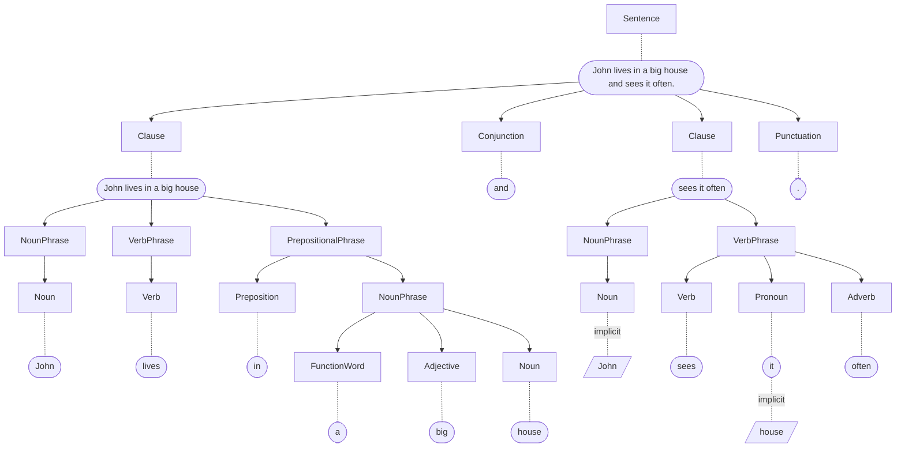

# TaBiThA

## Apps

### Ontology

https://github.com/presciencelabs/tabitha-ontology

### Sources

https://github.com/presciencelabs/tabitha-sources

### Editor

https://github.com/presciencelabs/tabitha-editor

### Targets

https://github.com/presciencelabs/tabitha-targets

## Contributing

### Resources

https://github.com/mdn/curriculum

### Development philosophies

1. classes at end of elements
1. minimal `if`'s
1. code indentation via <kbd>tab</kbd> instead of <kbd>space</kbd>
1. normalize data as close to source as possible, e.g., see how occurrences are handled in the Ontology app
1. pure functions, i.e., no changes outside of scope and no more that one arg at a time
1. components should be self-contained, i.e., always let parent be responsible for layout, positioning, etc., component should not assume anything outside its containment

# TBTA Basics

## What does it do?

### Luke 9:23 NIV

> Then he said to them all: “Whoever wants to be my disciple must deny themselves and take up their cross daily and follow me.

### Encoded into "Phase 1" form

> Jesus said to the people, ["[If you(people) want [to follow me(Jesus)]] you(people) must not do the things [that you(people) want [to do]]]. But you(people) must lift your(people's) cross every day. And you(people) must follow me(Jesus).

### Encoded into final, "Semantic" form

#### Raw encoding

`~\\wd ~\\tg c-IDp00NNNNNNPNNNNNN.............~\\lu {~\\wd ~\\tg C-1A.....~\\lu then~\\wd ~\\tg n-SAN.N........~\\lu (~\\wd ~\\tg N-1A1SDAnK3NN........~\\lu Jesus~\\wd ~\\tg ~\\lu )~\\wd ~\\tg v-S.....~\\lu (~\\wd ~\\tg V-1ArUINAN...........~\\lu say~\\wd ~\\tg ~\\lu )~\\wd ~\\tg n-SdN.N........~\\lu (~\\wd ~\\tg N-1A2PDAnK3NN........~\\lu person~\\wd ~\\tg ~\\lu )~\\wd ~\\tg c-PDpRHFNNNNNPNNNNNN.............~\\lu [~\\wd ~\\tg r-1A.....~\\lu -QuoteBegin~\\wd ~\\tg c-EDpRHFNNNNNPNNNNNN.............~\\lu [~\\wd ~\\tg P-1A.....~\\lu if~\\wd ~\\tg n-SAN.N........~\\lu (~\\wd ~\\tg N-1A2PDAnK2NN........~\\lu person~\\wd ~\\tg ~\\lu )~\\wd ~\\tg v-S.....~\\lu (~\\wd ~\\tg V-1BPUINAN...........~\\lu want~\\wd ~\\tg ~\\lu )~\\wd ~\\tg c-PDpRHFNNNNNPNNNNNN.............~\\lu [~\\wd ~\\tg n-SAN.N........~\\lu (~\\wd ~\\tg N-1A2PDAnK2NN........~\\lu person~\\wd ~\\tg ~\\lu )~\\wd ~\\tg v-S.....~\\lu (~\\wd ~\\tg V-1CPUINAN...........~\\lu become~\\wd ~\\tg ~\\lu )~\\wd ~\\tg n-SSN.N........~\\lu (~\\wd ~\\tg N-1A3SDAnK3NN........~\\lu disciple~\\wd ~\\tg n-SNN.N........~\\lu (~\\wd ~\\tg P-1A.....~\\lu -Generic Genitive~\\wd ~\\tg N-1A1SDAnK1NN........~\\lu Jesus~\\wd ~\\tg ~\\lu )~\\wd ~\\tg ~\\lu )~\\wd ~\\tg ~\\lu ]~\\wd ~\\tg ~\\lu ]~\\wd ~\\tg n-SAN.N........~\\lu (~\\wd ~\\tg N-1A2PDAnK2NN........~\\lu person~\\wd ~\\tg ~\\lu )~\\wd ~\\tg v-S.....~\\lu (~\\wd ~\\tg V-1AEUfrNN...........~\\lu please~\\wd ~\\tg ~\\lu )~\\wd ~\\tg n-SPN.N........~\\lu (~\\wd ~\\tg N-1A2PDAnK2NN........~\\lu person~\\wd ~\\tg ~\\lu )~\\wd ~\\tg ~\\lu ]~\\wd ~\\tg .-~\\lu .~\\wd ~\\tg ~\\lu }~\\wd ~\\tg c-IDpRHFNNNNNPNNNNNN.............~\\lu {~\\wd ~\\tg C-1A.....~\\lu but~\\wd ~\\tg n-SAN.N........~\\lu (~\\wd ~\\tg N-1A2PDAnK2NN........~\\lu person~\\wd ~\\tg ~\\lu )~\\wd ~\\tg v-S.....~\\lu (~\\wd ~\\tg V-1AEUfNAN...........~\\lu lift~\\wd ~\\tg ~\\lu )~\\wd ~\\tg n-SPN.N........~\\lu (~\\wd ~\\tg N-1A4SFAnK3NN........~\\lu cross~\\wd ~\\tg n-SNN.N........~\\lu (~\\wd ~\\tg P-1A.....~\\lu -Owner~\\wd ~\\tg N-1A2PDAnK2NN........~\\lu person~\\wd ~\\tg ~\\lu )~\\wd ~\\tg ~\\lu )~\\wd ~\\tg n-SNN.N........~\\lu (~\\wd ~\\tg j-SA.....~\\lu (~\\wd ~\\tg A-1AN.....~\\lu each~\\wd ~\\tg ~\\lu )~\\wd ~\\tg N-1A5SGAnK3NN........~\\lu day~\\wd ~\\tg ~\\lu )~\\wd ~\\tg .-~\\lu .~\\wd ~\\tg ~\\lu }~\\wd ~\\tg c-IDpRHFNNNNNPNNNNNN.............~\\lu {~\\wd ~\\tg C-1A.....~\\lu and~\\wd ~\\tg n-SAN.N........~\\lu (~\\wd ~\\tg N-1A2PDAnK2NN........~\\lu person~\\wd ~\\tg ~\\lu )~\\wd ~\\tg v-S.....~\\lu (~\\wd ~\\tg V-1BEUfNAN...........~\\lu follow~\\wd ~\\tg ~\\lu )~\\wd ~\\tg n-SPN.N........~\\lu (~\\wd ~\\tg N-1A1SDAnK1NN........~\\lu Jesus~\\wd ~\\tg ~\\lu )~\\wd ~\\tg .-~\\lu .~\\wd ~\\tg ~\\lu }~`

#### Simplified

`[C then(Con) [NP Jesus(N) ] [VP say(V) ] [NP person(N) ] [C -QuoteBegin(Par) [C if(Adp) [NP person(N) ] [VP want-B(V) ] [C [NP person(N) ] [VP become-C(V) ] [NP disciple(N) [NP -Generic Genitive(Adp) Jesus(N) ] ] ] ] [NP person(N) ] [VP please(V) ] [NP person(N) ] ] . ] [C but(Con) [NP person(N) ] [VP lift(V) ] [NP cross(N) [NP -Owner(Adp) person(N) ] ] [NP [AdjP each(Adj) ] day(N) ] . ] [C and(Con) [NP person(N) ] [VP follow-B(V) ] [NP Jesus(N) ] . ]`

### Generation to target language

_English used as a target language here for simplicity._  Even though the source and the targets are the same, the verses are different due to the simpler grammar.

> Jesus said to the people, “If you want to follow me, you must not do the things that you want to do. But you have to lift your cross each day. And you have to follow me.

## Components

### Ontology

Holds all of the semantic concepts that can be used in a semantic representation, along with their meanings and expected context.

### Semantic representation

The TBTA-specific encoding for each sentence in the source. This includes the clause/phrase structure and all the features on the concepts.

### Lexicon

The words of a target language, along with their associated features and forms. Some examples are shown below:

1. In English, a singular noun is the same as the noun stem. A plural noun by default adds the suffix 's' (with some exceptions)
1. In English, a noun has a 'Gender' feature marked as Male (use 'he'), Female (use 'she'), or Neuter (use 'it') so the grammar can select the appropriate pronoun.
1. In Tagalog, a noun needs no such feature because there is no grammatical gender (but it will need other features relevant to the Tagalog grammar)
1. In Gichuka, a verb always ends in -a, -ia, or -ii. A 'Final Vowel' feature on the verb tells the grammar what ending to add to the stem.

### Grammar

The rules to accomplish transforming the semantic representation into target language text. Some examples are shown below:

1. In English, add 'that' before a noun that is marked as 'Distal', eg. 'that man (over there)'
1. In English, use the Past form of a verb when marked as 'Discourse' or any level of past
1. In Spanish, place an adjective after the noun.
1. In Gichuka, add a -wa suffix to a passive verb.

## Structures

### Sentence

> John lives in a big house and sees it often.

