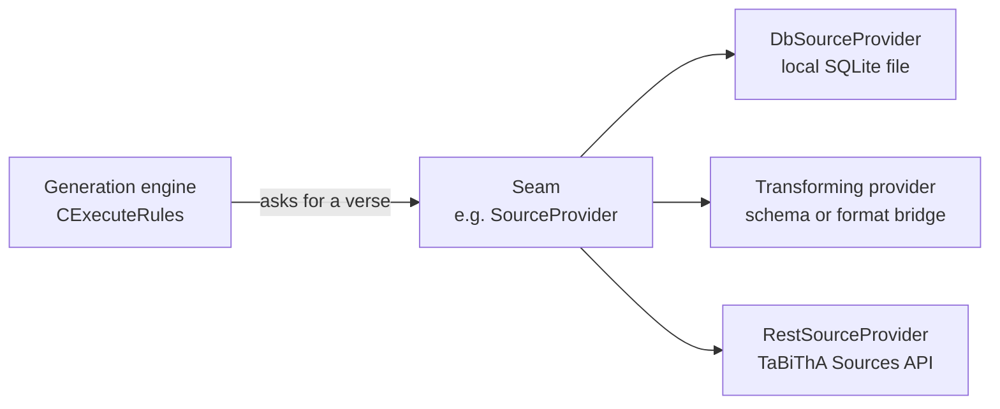
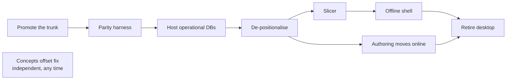

# TBTA to TaBiThA

> **This is thinking out loud, not a plan of record.** It is an attempt to find the discrete problems in moving TBTA toward TaBiThA and describe each one clearly enough to discuss. Nothing here is scheduled, assigned, or agreed beyond the few things marked as decided.

Working sketch · September 2026

---

## The short version

**The offline engine already works.** Dave compiled TBTA's real generation engine to WebAssembly, ran it in a browser, and persisted the databases offline. He also wired it to read source data from TaBiThA's live API.

**The operational databases aren't hosted yet.** TaBiThA publishes small derived read-models; the engine needs the full 227-table article, which today lives on Tod's machine and travels as files. TaBiThA's databases are where that should land — getting them there is the critical path.

**The data encodes meaning by position.** A feature's identity is its row number. Half the schema is empty placeholder slots that exist only because inserting a row would corrupt every verse ever encoded. This is the structural flaw underneath everything else.

| | |
| --- | --- |
| **227** | Tables in one operational target database |
| **27** | Of them `Rules_*` — the linguistics, stored as data |
| **25,881** | Lines in `ExecuteRules.cpp`, the interpreter |
| **64 / 128** | Feature slots that are empty `Spare` placeholders |

---

## What already exists

*Found on `main` (formerly `wip/refactor`) in the `tbta` repo*

- **TbtaLib** — the engine without the UI. 54 files, zero dialogs.
- **BrowserTest** — WebAssembly build generating verses in a Web Worker, databases persisted offline.
- **RestSourceProvider** — a spike showing the engine *can* read verses from TaBiThA's web API. Excluded from Windows builds (`#ifndef WIN32`) and still parsing JSON by string search, so it is a proof of shape, not a migration.
- **CMake + CI** — release builds for Windows, Linux and macOS ARM64.
- **Parity hooks** — `--generate` and `--export-generated-cci` for golden-output testing (why that matters is under the parity harness, below).

<details>
<summary>Detail</summary>

**TbtaLib** holds the persistence layer (`CTA1Doc`) and generation engine (`CExecuteRules`). Dependency-injected handlers replaced the MFC coupling, so the engine runs with console, null or browser implementations of anything it used to ask a window for. The desktop application survives intact alongside it — all 398 files.

**BrowserTest** calls `Module._GenerateVerse(lang, audience, source, book, chapter, verse, segment)` and returns target text. Databases are fetched once into IDBFS and reused — `Ontology.sqlite`, `Bible.sqlite`, and per-language files.

**TbtaCore** wraps the engine in a simplified API; Dave's README calls it "intended for linking into a future web application."

*Caveat:* this is read from committed code, not built and run. Worth confirming the WebAssembly build still compiles before leaning on it.

</details>

---

## The seam — how capabilities move



*The engine asks for a verse and cannot tell where the answer came from. Any of the three can be wired in — including more than one at once, if some capability ends up staying local longer than others.*

A **seam**, in the legacy-code sense: a place where behaviour can be changed without editing there. `SourceProvider` is the first one — a single method, several possible implementations, and the engine cannot tell which it was handed.

A seam sits between TBTA's legacy call sites and wherever the data actually comes from. It is not confined to "read the local database" or "call TaBiThA." It can hold simple data transformations, and anything in between — including hybrid states that exist only partway through a migration:

- Read from the local database, but return the new schema.
- Read from TaBiThA, but convert to the legacy positional encoding the engine still expects.
- Serve a cached slice offline and the live API when connected.

The point is to **touch the legacy call sites once**. Without this seam, every capability that moves means another edit to the same call sites, and the interim states — half-converted schemas, partial migrations, temporary bridges — leak into code that should not have to know about them. The seam absorbs that instead.

It is also where the de-positionalisation bridge would live: emit named keys in the distributed artifacts while converting to positional strings at load, so field data gets the new model before all 145 engine call sites have been rewritten.

The recipe for moving a capability, then:

1. Express it as a seam.
2. Implement it exactly as it behaves today.
3. Add implementations for where it is going — TaBiThA, a transformed local read, or a hybrid.
4. Change which implementation is supplied.
5. *Then* retire the local editing surface, once nothing needs it.

TBTA ends up as GUI elements over modules whose backing store has quietly become TaBiThA.

| Capability | Where it lives today | TaBiThA counterpart | State |
| --- | --- | --- | --- |
| Ontology | `DisplayOntologyDlg`, `WordListDlg` | Ontology app | Migrating |
| Analyzer | `ParagraphAnalysis.cpp` (9.5k lines) | Not yet decided | Experimental |
| Rule application | `ExecuteRules.cpp` (25.9k lines) | Stays compiled — WebAssembly | Extracted |
| Lexicon & forms | `SourceAndTargetView`, `TargetView` | Targets app | Read-models only |
| Rule editing | ~40 `*RuleDlg` dialogs | Undecided — *not* the Editor app | Untouched |

<details>
<summary>Why rule editing is smaller than forty dialogs implies</summary>

Ten of the rule tables share an identical twelve-column core — `SyntacticCategory`, `GroupName`, `RulesName`, `Status`, `Comment`, `References`, `GrammarTopics`, `InputStructures`, `OutputStructures` and formatting fields. One generalised structural editor could plausibly cover that cluster; the remaining tables are small enough for ordinary forms. Volumes are modest too — 309 complex-concept rules, 93 transfer, 28 phrase-structure, 19 spellout in English.

The hard part is not the CRUD. Editing a rule means editing its `InputStructures` payload — a nested, positionally encoded representation of linguistic structure. That is a tree editor, and its difficulty is downstream of the positional encoding below.

*Caveat:* shared columns do not guarantee shared editing semantics. That needs the format decoded before anyone should believe one editor suffices.

</details>

---

## Compile the engine, or rewrite it?

This is the one irreversible technical bet in the whole migration.

The linguistic knowledge is **data, not code** — twenty-seven rule tables that port for free under any strategy. What is trapped in code is the interpreter: nearly twenty-six thousand lines of accumulated execution semantics, the decades of edge-case behaviour nobody wrote down.

Reproducing that is the high-risk, low-reward half of the work, and it is exactly what a WebAssembly build gives you at no cost. A rewrite buys nothing the compile doesn't and introduces silent wrongness that would be hard to detect. Revisit only if the parity harness gives you a reason to.

---

## Splitting the data for offline — scope first

**Scope is the distinction that does the work.** The ontology and the source texts are *global* — every project reads the same copy, and only about three people ever change them. Everything else is *scoped to one target-language project*, so a team's work never touches another project's data. That single fact is what keeps offline sync tractable, and it is why the Targets app already runs one database per project.

Within a project's own database, three kinds of data behave differently:

| Data | Scope | Size | Who writes it, and when | Offline strategy |
| --- | --- | --- | --- | --- |
| **Ontology & source texts**<br>concepts, Bible, semantic encodings | Global — shared by every project | 61 MB<br>78 MB | ~3 people, rarely | Versioned snapshot, delta refresh. Read-only offline; no merge. |
| **Grammar & lexicon**<br>the 27 `Rules_*` tables, words, forms, features | One project | part of<br>11–35 MB | That project's team, during grammar development | Authored online for MVP. Read-only on the field client. |
| **Target text & notes**<br>the `Target_*` tables, one per book | One project | part of<br>11–35 MB | Rewritten on *every* regeneration, and hand-edited by translators | The real two-way path. Largely reproducible from the two rows above. |

The third row is the one that carries the write traffic. Generating a verse writes its result straight into that project's `Target_*` table — so the project database is *actively written during ordinary work*, not merely read. What makes this tolerable is not that writes are rare; it is that they are **scoped to one project** and **mostly reproducible**: given the same rules, lexicon and source, the engine regenerates the same text.

So the MVP sync engine is a snapshot fetcher for the global data, a read-only slice of the project's grammar and lexicon, and a genuine two-way path only for target text and notes. The per-project split this leans on is already real rather than planned: TaBiThA's Targets app runs one database per language project, chosen for write-concurrency and access-control isolation.

> **Conflict handling — decided**
>
> Last write wins, to begin with. If that causes real problems in practice, options can be explored then — it is not worth designing conflict resolution for a collision that may never materialise at this team size, with per-project isolation already limiting the blast radius.

---

## Positional coupling — the structural flaw underneath everything

```text
Features_Source — row order
┌──────────┬──────────────────┬──────────┬───────────┬─────────────┬─────────────┐
│    1     │        2         │    3     │     4     │      5      │    9–16     │
│  Number  │ Partic. Tracking │ Polarity │ Proximity │ Specificity │  Spare × 8  │
└────╥─────┴────────╥─────────┴────╥─────┴─────╥─────┴──────╥──────┴─────────────┘
     ║              ║              ║           ║            ║
Encoded feature string — character position
┌────╨─────┬────────╨─────────┬────╨─────┬─────╨─────┬──────╨──────┬─────────────┐
│    –     │        A         │    –     │     –     │      C      │      –      │
└──────────┴──────────────────┴──────────┴───────────┴─────────────┴─────────────┘
                                    │
        ┌───────────────────────────┼───────────────────────────┐
        ▼                           ▼                           ▼
  Rule structures            Encoded corpus                The engine
  Input/OutputStructures     every verse, ever             ~145 index sites

  Insert or reorder one row and every later position shifts.
  All three silently reinterpret their data. Hence the eight Spare slots.
```

*A feature has no name in the data it describes — only a position. That position is the contract binding the analyzer, the rules and the engine together, which is why those modules resist separation.*

It appears in three forms, each with a different remedy.

| Variant | Mechanism | Evidence | Remedy |
| --- | --- | --- | --- |
| **Feature encoding** | Row order in `Features_Source` = character offset | 64 / 128 slots are `Spare` | Large. Touches rules, corpus and engine together. |
| **Lexical form slots** | Position maps to a name *per category*; storage holds empty slots open | `Form 1–4`<br>`…^\|\|4,50…` | Smaller. Also kills a dual-addressing bug class. |
| **Offset writes** | `Concepts` updates target a row by its offset in a sorted list | a few call sites | Small, local, independent of the other two. |

None of these need linguistic judgement to repair. Every one has its stable identity **already present in the data** — `Features_Source` stores each feature's real name; `LexicalFormNames` stores each form's name and category. The mapping from position to name exists today; it simply isn't what the data uses.

That makes de-positionalisation mechanical, with a hard correctness test: re-encode into named keys, decode back, assert byte-identical round trips, then confirm generation output is unchanged.

<details>
<summary>The lexical form variant, and why it is worse than it looks</summary>

`LexicalFormNames` maps position to name *per syntactic category* through a `FieldName` column holding `Form 1`–`Form 4`. "Form 2" means *Perfect* for a verb and *Superlative* for an adjective — there is no global form identity at all.

Storage keeps empty positions open to preserve alignment. A verb's `FormReferences` reads `…^|4,7,13,23^||4,50,4,18^…`, where the doubled separator is a form slot with no data that cannot be removed. The lexicon tables carry literal `Spare 2`–`Spare 5` columns for the same reason.

What makes it worse than the feature case is that **two addressing schemes coexist**. Storage addresses forms positionally; the spellout rules address them by name through a `BaseForm` text column. Nothing enforces agreement, so renaming a form silently desynchronises them — the bug behind the commit reading *"when the user changes the name of a lexical form, the spellout rules… must be updated with the new form name."*

</details>

> **Sequencing — decided**
>
> Forms convert first (smaller, and it eliminates the dual-addressing bug class), then the feature encoding. Conversion runs **before** the offline client's slice specifically: that slice goes to field devices over poor connections, so shipping the old encoding would mean re-downloading tens of megabytes to the users least able to afford it. The `Concepts` offset writes are independent and need not gate the ontology CRUD work already underway.

---

## The trunk changes hands

Decided with Tod, executed by Dave — September 2026.

**Done.** `wip/refactor` is now `main` — confirmed as the repository's default branch, with the release workflow retargeted (its own latest commit reads "Change release target from 'wip/refactor' to 'main'"). The former `main` is renamed **`classic`**, where Tod continues working in the style he is comfortable with.

This inverts the earlier assumption. The refactor lineage is now the trunk; Tod's branch is the tributary. That is a better arrangement than a permanent fork, because it gives the modernised code a distribution path instead of leaving it parked on a branch — but it makes one thing structural that used to be housekeeping.

| Branch | Last commit | Status | Carries | |
| --- | --- | --- | --- | --- |
| `main` | Sep 2026 | — | TbtaLib, TbtaCore, BrowserTest, CMake, CI, REST provider | Trunk |
| `classic` | Sep 2026 | 8 to translate | Tod's ongoing work, original layout | Tributary |
| `wip/community-doc-refactor` | Feb 2026 | 1 commit | Portability work — now mostly absorbed into `main` | Near-retirement |
| `feature/auto-backup` | Oct 2025 | 1 commit | One self-contained commit | Pickable |

`wip/tabitha-ontology` and `wip/tbta-local` are gone from the remote entirely — deleted, not merely stale. Neither is an ancestor of the new `main`, which looked like a real risk of lost work until checked directly: `main` already carries the TaBiThA `Concepts` schema, the ROWID-based sync matching, and the removal of the old concept-hierarchy browser — everything that mattered from `wip/tabitha-ontology`. It arrived independently, most likely by repeatedly merging `main` into `wip/refactor` over the months both branches were active, rather than by merging that branch specifically. Net effect: no loss, safe to treat as resolved.

`wip/community-doc-refactor` tells a similar story at smaller scale. It carried real, valuable portability work — Linux and Node harnesses, clang compliance, UTF-8 correctness — and it is now **225 commits behind `main` with only one commit not already absorbed.** The goal that work was chasing is already achieved: `main`'s own README documents native Windows, Linux and macOS build targets. The one remaining commit (`Modifying GetCommunityDocuments Version to use SQLite call`) is a five-minute decision — pick it or drop it — after which the branch can be deleted outright.

What remains open is **translation**, and it is real, not resolved. Tod authors in the old layout; the trunk uses a different one, so his changes cannot be cherry-picked — they have to be re-expressed by hand, indefinitely, at whatever rate he writes code. `classic` currently holds eight commits not yet reflected in `main`, including the John 1:14 fix and the C++20 migration. That backlog is the actual measure of whether the new arrangement is being kept up, not branch age.

> **Dave's conversion work**
>
> Dave doesn't expect converting Tod's changes to be much trouble. AI might be an option for some of the more routine work around that — keeping a record of how the conversion is done, easing handover, and filling in tests.
>
> Tests are the part that matters most, and the parity harness is a strong one — translated code that regenerates the corpus identically is good evidence the translation held. Worth keeping an eye on cadence; falling behind tends to happen gradually.

---

## From read-models to operational — the critical path

**TaBiThA's databases are where the operational data should live.** That is the destination, and nothing here argues otherwise. What follows is what standing them up actually involves — because today they are not that yet.

The English targets database TaBiThA serves is a *derived extract*: six tables, about 7 MB, built for search and lookup by the migration pipeline in `tools/databases`. The operational article is the TBTA-side file — 227 tables, about 35 MB, including all 27 `Rules_*` tables. It lives on Tod's machine and travels as a file.

Two things change on the way there:

- **The flow reverses.** Today TBTA is the source of truth and TaBiThA the consumer — export, migrate, publish. Operational means TaBiThA holds the writes and TBTA reads from it. That is the provider pattern's "flip the default" step, applied to storage rather than to a code path.
- **Two delivery shapes are needed.** D1 answers the web app's queries; an offline client needs a file it can put into origin-private storage. So this produces both — the live database, plus versioned snapshot files in object storage for slicing and distribution.

Until that exists, three things stay blocked on the same missing piece: online authoring has nowhere to write, offline generation has nothing to slice from, and parity testing has no named version to test against. It is unglamorous plumbing, which is exactly why it is worth naming before the interesting work crowds it out.

---

## The pieces, and what actually blocks what

Not a running order.

These are the distinct problems we have found so far, not a sequence anyone has to follow. Some genuinely depend on each other — the parity harness has to exist before anyone trusts a de-positionalisation, because it is what would catch a mistake. Most of the rest can move whenever someone has reason to pick them up, and several can run at the same time.

The diagram below shows only the dependencies we think are real. Everything not connected by an arrow is unordered.



*Arrows are the dependencies we actually believe in — mostly "this would be reckless without that." The offline work and the authoring work are independent of each other, and the `Concepts` offset fix is independent of everything. Where an arrow feels wrong, it probably is; say so.*

### Promote the trunk

**Done.** `main` renamed to `classic`, then `wip/refactor` renamed to `main`. The default branch is confirmed as the new `main`, and the release workflow is retargeted to it.

*We would know this worked if* a release builds from the new trunk without anyone hand-delivering it. **Not yet proven** — the workflow has five successful runs, but all of them predate the rename, built from the old `wip/refactor` name. Nobody has triggered it since. Worth doing once, deliberately, to confirm nothing about the rename — paths, branch protection, permissions — broke it silently.

<details>
<summary>Sweep afterwards</summary>

`wip/tabitha-ontology` and `wip/tbta-local` are already deleted, and checked to have caused no loss. `wip/community-doc-refactor` is one commit from safe deletion. What is still open: workflow triggers or documentation pinned to the old branch names, and everyone's local clones re-pointed.

</details>

### Build the parity harness

Regenerate every verse in every target language from desktop TBTA as golden output, run the same corpus through WebAssembly, and diff.

*We would know this worked if* desktop and browser output match across the full corpus, unattended.

<details>
<summary>Why this one carries so much weight</summary>

It is the safety net for everything after. With it the engine can be refactored, ported and converted with confidence, and any future rewrite question becomes answerable with evidence rather than nerve. Without it the later work is flying blind. The `--generate` and `--export-generated-cci` hooks already exist.

</details>

### Host the operational databases

Make the full 227-table databases versioned, hosted artifacts rather than files passed between people. Content-addressed snapshots, object storage for blobs.

*We would know this worked if* a named version of any project's database is fetchable by URL, with auditable provenance.

### De-positionalise the data model

Replace position-as-identity with stable named keys, following the ontology's pattern. Lexical forms first, then the source feature encoding. Each conversion verified by round-trip equality, then by unchanged generation output.

*We would know this worked if* no `Spare` slots remain, features and forms are addressed by name, and the corpus round-trips with identical output.

### Build the slicer

A general extraction capability, not a single-purpose offline bundle. The offline field client is one consumer — it wants one project's rules, forms, and referenced ontology concepts, complete enough to generate correctly. It won't be the only one: a grammar-builder tool might want a project's rules and features with none of its lexicon; other tooling will want other cuts as it gets built. The reusable work is the dependency analysis — what a given scope actually depends on — not the packaging for any one consumer.

*We would know this worked if* at least one real consumer's slice is verified correct for its own use case. For the offline client that means matching full-database generation output via the parity harness; other consumers will need their own correctness check, not this one.

### Ship the offline shell

The PWA around the WebAssembly engine: origin-private filesystem storage, engine in a Web Worker, snapshot fetch with delta refresh. Grammar, lexicon and sources read-only; target text and notes the only two-way path.

*We would know this worked if* a translator can install it, go offline, generate, and reconnect without losing work.

### Move authoring online, surface by surface

Ontology CRUD is the template: build the web surface, then make the TBTA screen read-only. Repeat per rule type, each backed by the hosted databases. The long one, and the safely incremental one.

*We would know this worked if* each migrated surface is read-only in TBTA and authoritative on the web.

### Retire the desktop application

TBTA becomes optional, then archived. Backflow stops. The fork stops being a fork and becomes the software.

*We would know this worked if* no workflow requires Windows.

---

## Open questions — decisions this sketch cannot make

### Database distribution beyond the ontology

Automated binary releases are a good start, and the existing workflow already builds and packages executables for Windows, Linux and macOS. Databases travel separately: R2 hosting and the download path are built for the ontology, and the intent is to extend the same approach to the other databases as needed. How that generalises — which databases, at what sizes (English 35 MB, Bible 78 MB), on what versioning and refresh cadence — is open, and is a conversation to have with Dave.

### Ontology cutover — the pieces already exist

Tod has agreed to shut down the ontology update path in TBTA in favour of the web app. Both halves of the transitional flow are already built: TBTA checks for an `Ontology.new` file at startup, attaches it and merges; the web app serves exactly that download from R2 via response headers. Schema is not a risk either — `main` already uses the TaBiThA `Concepts` model (`stem`, `sense`, `part_of_speech`, `gloss`, `note`, `categorization`, `curated_examples`, `level`), with no references left to the legacy `LN *` columns.

What remains is demonstrating it end to end for Tod — a session was attempted but hit enough issues that only a few capabilities were shown. Craig is making the capabilities runnable locally so a full walkthrough, including downloading an updated ontology and seeing web-app changes appear in TBTA, can be shown.

### Operational database ownership

Who owns hosting the 227-table databases, and where do they live? The critical path, currently unowned.

### Adopting D1's migration process

The current approach scripts a migration into a newly-named ontology database. Moving to Cloudflare's D1 migration process — versioned migrations applied in place — is worth investigating instead. The download path is unaffected either way, since it already serves from R2 independently of how the schema evolves.

### Where rule editing lands, and who designs it

Rule editing has *no* TaBiThA counterpart today. It is not the Editor app, whose remit is grammar and rule *checking*, analysis and AI assistance rather than rule authoring. Rule authoring is also strongly project-specific, so it is genuinely undecided this early whether it becomes its own app, part of Targets, or something else.

Wherever it lands, the tree editor over `InputStructures` is the most demanding interface design in the migration. The approach will be collaborative — the TaBiThA team exploring alternatives together. Decoding the `InputStructures` grammar into a documented representation is the natural first step, since the editor cannot be designed against a format nobody has written down.

---

*Notes, not a commitment. Sizes, branch positions and code measurements come from the `tbta` and `tabitha` repositories and will drift — most were checked in early September 2026, branch state on the 11th. Anything not verified against the repos is flagged where it appears.*
