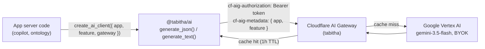

# @tabitha/ai

Shared LLM plumbing for every TaBiThA app. Owns response parsing, retry/telemetry config, credentials, and the Cloudflare AI Gateway routing — so call sites only supply a prompt, a schema (for JSON calls), and per-call overrides. See [ADR 0007](../../docs/decisions/0007-ai-consolidation.md) for the full rationale.

## Request flow



Every call is routed exclusively through **Google Vertex AI** (never plain Google AI Studio) via a single shared gateway named `tabitha`. The gateway — not the app — holds the real Google credentials (BYOK); apps authenticate to it with one `AI_GATEWAY_TOKEN`. Gateway-side behavior (cache TTL, rate limiting, retry/backoff, prompt-injection guardrails) is provisioned by `tools/gateway`, not this package — see [`tools/gateway/README.md`](../../tools/gateway/README.md).

## Usage

```ts
import { create_ai_client } from '@tabitha/ai'

const ai = create_ai_client({
	app: 'copilot',
	feature: 'brief',
	gateway: {
		account_id: env.CLOUDFLARE_ACCOUNT_ID,
		gateway_name: 'tabitha',
		token: env.AI_GATEWAY_TOKEN,
		project: env.GEMINI_PROJECT_ID,
		location: env.GEMINI_LOCATION,
	},
})

const result = await ai.generate_json<MyShape>({
	contents: myPromptContents,
	schema: myJsonSchema,
})
```

`app`/`feature` are attached to every request as `cf-aig-metadata` for per-app cost/usage attribution in the gateway dashboard; they don't affect caching (confirmed empirically — see ADR 0007).

## Embeddings

`create_embedding_client` is a separate, smaller factory for turning text into vectors (used by ontology's semantic search -- see [ADR 0016](../../docs/decisions/0016-semantic-search-via-vectorize-embeddings.md)). It goes through the same gateway, token, and error handling as `create_ai_client`.

```ts
import { create_embedding_client } from '@tabitha/ai'

const embedder = create_embedding_client({ app: 'ontology', feature: 'semantic-search', gateway })

const query_vector = await embedder.embed_text({ purpose: 'query', text: 'joy' })
const document_vector = await embedder.embed_text({ purpose: 'document', title: 'rejoice', text: 'to feel great happiness' })
```

- **Fixed:** model `gemini-embedding-2` (`EMBEDDING_MODEL`), 768 dimensions (`EMBEDDING_DIMENSIONS`), and the `global` location -- the only one Vertex serves this model from, whatever `gateway.location` says.
- **One text per call.** The model has no batch endpoint and fuses every part of a request into one vector, so there's no batch API to misuse.
- **`purpose` instead of a task type.** `gemini-embedding-2` takes retrieval intent as a prefix written into the text itself; `format_embedding_input` applies Google's documented prefixes, so a query and the documents it's matched against are embedded consistently.

## What's fixed vs. overridable

- **Fixed package-wide, never overridable per call:** gateway base URL, auth headers, `model` (`gemini-3.5-flash`), `seed` (`42`). Two apps drifted to different values for both pre-consolidation with no real justification, so both are centralized now; see ADR 0007's "Resolved questions" if a genuine per-call need for either resurfaces.
- **Overridable** (`AiCallDefaults`, layered package defaults ← per-client `defaults` ← per-call `config`): `temperature`, `frequencyPenalty`, `presencePenalty`, and the rest of Google's `GenerateContentConfig` except `seed`.

## Errors

Both `generate_json` and `generate_text` throw `AiResponseError` on an empty or unparseable model response — one consistent failure mode across every call site, replacing the four divergent ones ADR 0007 cataloged.
